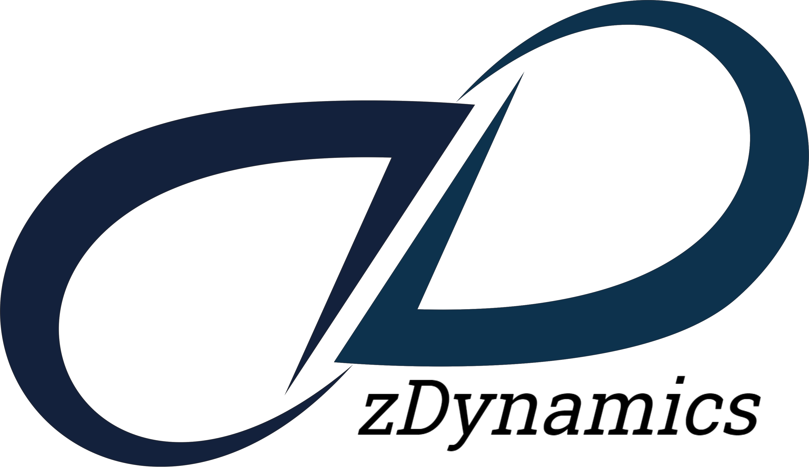

# zRobotics 0.2

[](https://opensource.org/licenses/MIT) [](https://creativecommons.org/licenses/by-nc/4.0/)

A powerful library for robotics analysis :mechanical_arm: :robot:

- Index :card_index_dividers:
    - [Introduction](#introduction-books) :books:
    - [Features](#features-sparkles) :sparkles:
    - [Future Work](#future-work-cloud) :cloud:
    - [Before Starting](#before-starting-warning) :warning:
      - [Symbolic Computation](#symbolic-computation-warning) :warning:
    - [Library Content](#library-content-book) :book:
      - [How to import it?](#how-to-import-it-man_technologist) :man_technologist:
      - [(Brief) Libraries' Description](#brief-libraries-description-blue_book) :blue_book:
    - [Movements](#movements)
      - [Translation](#translation)
      - [Rotation](#rotation)
    - [Dual Quaternions Functionalities](#dual-quaternions-functionalities)
      - [Dual Quaternions Multiplication](#dual-quaternions-multiplication)
      - [Dual Quaternions Conjugate](#dual-quaternions-conjugate)
      - [Dual Quaternions to Euclidian Space](#dual-quaternions-to-euclidian-space)
    - [Robot Creation and Setup](#robot-creation-and-setup-mechanical_leg) :mechanical_leg:
      - [Attributes](#attributes)
      - [Creation](#creation)
      - [Denavit - Hartenberg Parameters](#denavit---hartenberg-parameters)
      - [Centers of Mass](#centers-of-mass)
    - [Kinematics](#kinematics)
      - [Forward Kinematics](#forward-kinematics)
      - [Forward Kinematics to Center of Mass](#forward-kinematics-to-centers-of-mass)
      - [Axis - Angle Vector](#axis---angle-vector)
      - [Inertial Jacobian Matrix](#inertial-jacobian-matrix)
        - [Derivative of Geometric Jacobian Matrix](#derivative-of-geometric-jacobian-matrix)
        - [Derivative of Geometric Jacobian Matrix of a Center of Mass](#derivative-of-geometric-jacobian-matrix-of-a-center-of-mass)
      - [Dual Inertial Jacobian Matrix](#dual-inertial-jacobian-matrix)
        - [Derivative of Dual Inertial Velocity Jacobian Matrix](#derivative-of-dual-inertial-velocity-jacobian-matrix)
        - [Derivative of Dual Inertial Velocity Jacobian Matrix of a Center of Mass](#derivative-of-dual-inertial-velocity-jacobian-matrix-of-a-center-of-mass)
      - [Inverse Kinematics (Error Feedback)](#inverse-kinematics-error-feedback)
    - [Differential Kinematics](#differential-kinematics)
      - [Total Inertial Rate of Change](#total-inertial-rate-of-change)
      - [Total Inertial Velocity](#total-inertial-velocity)
        - [Inertial Velocity Propagation](#inertial-velocity-propagation)
        - [Inertial Velocity Propagation Using Dual Quaternions](#inertial-velocity-propagation-using-dual-quaternions)
      - [Total Inertial Acceleration](#total-inertial-acceleration)
        - [Inertial Acceleration Propagation](#inertial-acceleration-propagation)
        - [Inertial Acceleration Propagation Using Dual Quaternions](#inertial-acceleration-propagation-using-dual-quaternions)
      - [Inertial Velocity to Centers of Mass](#inertial-velocity-to-centers-of-mass)
        - [Inertial Velocity Propagation to Centers of Mass](#inertial-velocity-propagation-to-centers-of-mass)
        - [Inertial Velocity Propagation to Centers of Mass Using Dual Quaternions](#inertial-velocity-propagation-to-centers-of-mass-using-dual-quaternions)
      - [Inertial Acceleration to Centers of Mass](#inertial-acceleration-to-centers-of-mass)
        - [Inertial Acceleration Propagation to Centers of Mass](#inertial-acceleration-propagation-to-centers-of-mass)
        - [Inertial Acceleration Propagation to Centers of Mass Using Dual Quaternions](#inertial-acceleration-propagation-to-centers-of-mass-using-dual-quaternions)
    - [Dynamics](#dynamics)
      - [Euler - Lagrange Formulation](#euler---lagrange-formulation)
        - [Kinetic Energy](#kinetic-energy)
        - [Inertia Matrix](#inertia-matrix)
        - [Potential Energy](#potential-energy)
        - [Lagrangian](#lagrangian)
        - [Gravitational Effects](#gravitational-effects)
        - [Centrifugal and Coriolis Effects](#centrifugal-and-coriolis-effects)
        - [Robot Model](#robot-model)

---

## Introduction :books:

You can use this simple library to analyze and develop kinematics and control algorithms for your robots as shown in our online trainigs:

- [Numerical Methods with Engineering Applications](https://bit.ly/NumericZ)
- [Control of Dynamical Systems](https://bit.ly/zControl) 
- [Robotics: from Kinematics to Control](https://bit.ly/RoboticZ)
 
We hope this library will help you to start your journey in these amazing discipline! :heart:

[*Return to top*](#zrobotics-02)

---

## Features :sparkles:

You can set your robot attributes and analyze its behavior. To achieve this, all the algorithms were developed using Homogeneous Transformation Matrices and Dual Quaternions algebra, however, **the logic used to develop them will allow you to adapt it to almost any embedded system!**

**For serial robots** (we will include new ones in the future :wink:), some interesting functionalities are listed below:

- [x] [Forward Kinematics](#forward-kinematics)
  - [x] [Using Homogeneous Transformation Matrices](/lib/kinematics/HTM.py#11) (numerical and symbolic)
  - [x] [Using Dual Quaternions](/lib/kinematics/DQ.py#11) (numerical and symbolic)
- [x] [Numerical Inverse Kinematics](#inverse-kinematics-error-feedback)
  - [x] [Using Homogeneous Transformation Matrices](/lib/kinematics/HTM.py#280)
  - [x] [Using Dual Quaternions](/lib/kinematics/DQ.py#135)
- [x] [Differential Kinematics](#differential-kinematics)
  - [x] [Using Homogeneous Transformation Matrices](/lib/kinematics/DifferentialHTM.py) (numerical and symbolic)
  - [x] [Using Dual Quaternions](/lib/kinematics/DifferentialDQ.py) (numerical and symbolic)
- [ ] Robot Dynamics
  - [x] [Differential Equation using Homogeneous Transformation Matrices](#dynamics)(numerical and symbolic)
  - [ ] Differential Equation using Dual Quaternions (numerical and symbolic) (:warning: **UNDER DEVELOPMENT** :warning:)

Feel free to modify, adjust and extend our work to your necessities :smiley:; this library allows you to get a first approach to robot analysis, synthesis and control, however, we will be adding new interesting features, also, **you can request new features or create new ones!**

[*Return to top*](#zrobotics-02)

---

## Future Work :cloud: 

We are working, or will start working soon, on the following tasks for future releases:

- [x] Velocity Recursive Algorithms
  - [x] Using Homogeneous Transformation Matrices
  - [x] Using Dual Quaternions
- [x] Acceleration Recursive Algorithms
  - [x] Using Homogeneous Transformation Matrices
  - [x] Using Dual Quaternions
- [ ] Euler - Lagrange formulation 
  - [x] Using Homogeneous Transformation Matrices
  - [ ] Using Dual Quaternions
- [ ] Newton - Euler Recursive Algorithm:
  - [ ] Using Homogeneous Transformation Matrices
  - [ ] Using Dual Quaternions


[*Return to top*](#zrobotics-02)

---

## Before Starting :warning:

This library can be used with [Python :snake: 3.10.4 - 64 bits](https://www.python.org/downloads/release/python-3104/) or above. Please install the following dependencies or make sure that they're already in your computer:

```bash
pip3 install numpy
pip3 install sympy
pip3 install matplotlib
```

**Please do not forget to set your Python Path** :wink:. Also, you can use ```pip``` depending on your Python version and/or configuration:

```bash
pip install numpy
pip install sympy
pip install matplotlib
```

If these modules were installed correctly, you will be able to use our library :smiley:

[*Return to top*](#zrobotics-02)

---

### Symbolic Computation :warning:

You can get your robot's equations in a symbolic form, however, please consider that **this computation is slower than numerical one**, also **resulting equations won't be simplified most of the times as we do in paper**. If you need to simplify the obtained results, you can use [```trigsimp()```](https://docs.sympy.org/latest/tutorial/simplification.html#trigsimp) function as follows:

```python

"""
  Example of symbolic simplification
"""

# Homogeneous Transformation Matrix library
from lib.movements.HTM import *

# SymPy library
from sympy import *

# Symbolical Homogeneous Transformation Matrix (multiplication is done with * because is a symbolic matrix)
H = rz(z = "q1", symbolic = True) * tx(x = "L1", symbolic = True) * rz(z = "q2", symbolic = True) * tx(x = "L2", symbolic = True)

# Simplified Homogeneous Transformation Matrix
Hsimplified = trigsimp(H)

```

So the outputs will be

```bash
>>> H
Matrix([[-sin(q1)*sin(q2) + cos(q1)*cos(q2), -sin(q1)*cos(q2) - sin(q2)*cos(q1), 0, L1*cos(q1) + L2*(-sin(q1)*sin(q2) + cos(q1)*cos(q2))],
        [ sin(q1)*cos(q2) + sin(q2)*cos(q1), -sin(q1)*sin(q2) + cos(q1)*cos(q2), 0,  L1*sin(q1) + L2*(sin(q1)*cos(q2) + sin(q2)*cos(q1))],
        [                                 0,                                  0, 1,                                                    0],
        [                                 0,                                  0, 0,                                                    1]])

>>> Hsimplified
Matrix([[cos(q1 + q2), -sin(q1 + q2), 0, L1*cos(q1) + L2*cos(q1 + q2)],
        [sin(q1 + q2),  cos(q1 + q2), 0, L1*sin(q1) + L2*sin(q1 + q2)],
        [           0,             0, 1,                            0],
        [           0,             0, 0,                            1]])
```

**Please consider that the bigger the equation, the slower the simplification**. Also [```trigsimp()```](https://docs.sympy.org/latest/tutorial/simplification.html#trigsimp) will find the best possible value, then sometimes **your simplification won't be the same as the computer's, but it doesn't mean equations are wrong, but they are equivalent** :wink:

[*Return to top*](#zrobotics-02)

---

## Library Content :book:

This library includes the following files:

```
zRobotics
├── img                 # Images for README.md file and related ones
├── lib                 # Python source files
|   ├── Robot.py        # Robot constructor
|   ├── movements
|   |   ├── DQ.py       # Rotations and translations using Dual Quaternios
|   |   └── HTM.py      # Rotations and translations using Homogeneous Transformation Matrices
|   ├── kinematics
|   |   ├── DQ.py                   # Forward and Inverse Kinematics functions using Dual Quaternios
|   |   ├── HTM.py                  # Forward and Inverse Kinematics functions using Homogeneous Transformation Matrices
|   |   ├── DifferentialDQ.py       # Velocities and accelerations using Dual Quaternions (UNDER DEVELOPMENT)
|   |   └── DifferentialHTM.py      # Velocities and accelerations using Homogeneous Transformation Matrices (UNDER DEVELOPMENT)
|   ├── dynamics
|   |   ├── DynamicsHTM.py          # Dynamics equations using Homogeneous Transformation Matrices 
|   |   └── Solver.py               # Numerical solvers for multiple purposes (UNDER DEVELOPMENT)
|   ├── plot
|   └── └── Plot.py     # For function plotting (UNDER DEVELOPMENT)
├── CODE_OF_CONDUCT.md
├── README.md           # Users' manual
├── LICENSE
└── main.py             # File to demonstrate functionalities
```

New functionalities can be added in future releases, so feel free to send an email to [**contact@zdynamics.org**](mailto:contact@zdynamics.org) requesting anything new :smiley:

[*Return to top*](#zrobotics-02)

---

### How to import it? :man_technologist:

Just open your terminal (depending on your operating system) inside ```zRobotics``` directory, then run ```python``` or ```python3``` and type ```from lib.NameOfLibrary.NameOfFile import *```, for example

```python
from lib.movements.HTM import *
```

So this will import the [```movements```](lib/movements/) library that uses [Homogeneous Transformations Matrices](lib/movements/HTM.py). If you have a Python project in another directory, just copy the ```lib``` folder and paste it into your project's directory:

```
your_project_root_directory
├── folder_1
|   ├──image.jpg
|   └── file0.c
├── folder_2
|   ├── test.ino
|   └── file1.py
├── lib                 # zRobotics Python source files
└── file2.py
```

Then, you will be able to use all our files from your root directory :wink:

[*Return to top*](#zrobotics-02)

---

### (Brief) Libraries' Description :blue_book:

1. [```lib.Robot```](/lib/Robot.py): this creates your robot as an object :robot: to facilitate algorithms implementation and usage, so what you have to do is to create its Denavit - Hartenberg Parameters Matrix. :warning: **It only allows to create serial manipulators** :warning:, but some other robots will be added soon
2. [```lib.movements```](/lib/movements): it can be used to compute the translational and rotational movements representation using Homogeneous Transformation Matrices or Dual Quaternions
4. [```lib.kinematics```](/lib/kinematics): based on Dual Quaternions algebra and Homogeneous Transformation Matrices, it solves the most common kinematics problems: from forward kinematics to differential one (**under construction :construction:**)
5. [ ```lib.dynamics```](/lib/dynamics): it has numerical integration and dynamical systems algorithms (**under construction :construction:**)
6. [```lib.plot```](/lib/plot): this allows to plot graphs of your robot's behavior (**under construction :construction:**)


Please take a look at [main.py](main.py) to know more about the commands, their implementation and the order they could be executed. **Feel free to  [contact us](mailto:contact@zdynamics.org) if you have any comment, suggestion or question** :smile:

[*Return to top*](#zrobotics-02)

---

## [Movements](/lib/movements/HTM.py)

You can compute translational or rotational movements with Homogeneous Transformation Matrices and Dual Quaternions

### Translation

You can compute translational movements on each axis of euclidian space: (x, y, z)

```python
"""
  Translational movement on "Y" axis
"""

# Homogeneous Transformation Matrix library
from lib.movements.HTM import *

# Dual Quaternions library
from lib.movements.DQ import *

# Using Homogeneous Transformation Matrix
H = ty(y = 0.5)

# Using Dual Quaternions
Q = dqTy(y = 0.5)
```

So the outputs will be

```bash
# NumPy Array
>>> H
array([[1. , 0. , 0. , 0. ],
       [0. , 1. , 0. , 0.5],
       [0. , 0. , 1. , 0. ],
       [0. , 0. , 0. , 1. ]])

# NumPy Array
>>> Q
array([[1.  ],
       [0.  ],
       [0.  ],
       [0.  ],
       [0.  ],
       [0.  ],
       [0.25],
       [0.  ]])
```

In case you need a symbolic expression, it's possible to call the same functions with a ```symbolic``` parameter:

```python
"""
  Translational movement on "Z" axis
"""

# Homogeneous Transformation Matrix library
from lib.movements.HTM import *

# Dual Quaternions library
from lib.movements.DQ import *

# Using Homogeneous Transformation Matrix
H = tz(z = 0.5, symbolic = True)

# Using Dual Quaternions
Q = dqTz(z = 0.5, symbolic = True)
```

Then the outputs will be shown as follows:

```bash
# SymPy Matrix
>>> H
Matrix([[1, 0, 0,   0],
        [0, 1, 0,   0],
        [0, 0, 1, 0.5],
        [0, 0, 0,   1]])

# SymPy Matrix
>>> Q
Matrix([[   1],
        [   0],
        [   0],
        [   0],
        [   0],
        [   0],
        [   0],
        [0.25]])
```

The functions for translational movements (with their default values) are shown below:

```python
"""
  Translational movements
"""

# Homogeneous Transformation Matrix library
from lib.movements.HTM import *

# Using Homogeneous Transformation Matrix
Hx = tx(x = 0, symbolic = False)
Hy = ty(y = 0, symbolic = False)
Hz = tz(z = 0, symbolic = False)


# Dual Quaternions library
from lib.movements.DQ import *

# Using Dual Quaternions
Qx = dqTx(x = 0.5, symbolic = True)
Qy = dqTy(y = 0.5, symbolic = True)
Qz = dqTz(z = 0.5, symbolic = True)
```

[*Return to top*](#zrobotics-02)

---

### Rotation

You can compute rotational movements on each axis of euclidian space: 

```python
"""
  Rotational movement on "Y" axis
"""

# Homogeneous Transformation Matrix library
from lib.movements.HTM import *

# Dual Quaternions library
from lib.movements.DQ import *

# Using Homogeneous Transformation Matrix
H = ry(y = 0.5)

# Using Dual Quaternions
Q = dqRy(y = 0.5)
```

So the outputs will be

```bash
# NumPy Array
>>> H
array([[ 0.87758256,  0.        ,  0.47942554,  0.        ],
       [ 0.        ,  1.        ,  0.        ,  0.        ],
       [-0.47942554,  0.        ,  0.87758256,  0.        ],
       [ 0.        ,  0.        ,  0.        ,  1.        ]])


# NumPy Array
>>> Q
array([[0.96891242],
       [0.        ],
       [0.24740396],
       [0.        ],
       [0.        ],
       [0.        ],
       [0.        ],
       [0.        ]])
```

In case you need a symbolic expression, it's possible to call the same functions with a ```symbolic``` parameter:

```python
"""
  Rotational movement on "Z" axis
"""

# Homogeneous Transformation Matrix library
from lib.movements.HTM import *

# Dual Quaternions library
from lib.movements.DQ import *

# Using Homogeneous Transformation Matrix
H = rz(z = 0.5, symbolic = True)

# Using Dual Quaternions
Q = dqRz(z = 0.5, symbolic = True)
```

Then the outputs will be shown as follows:

```bash
# SymPy Matrix
>>> H
Matrix([
       [0.877582561890373, -0.479425538604203, 0, 0],
       [0.479425538604203,  0.877582561890373, 0, 0],
       [                0,                  0, 1, 0],
       [                0,                  0, 0, 1]])

# SymPy Matrix
>>> Q
Matrix([[0.968912421710645],
        [                0],
        [                0],
        [0.247403959254523],
        [                0],
        [                0],
        [                0],
        [                0]])
```

The functions for rotational movements (with their default values) are shown below:

```python
"""
  Rotational movements
"""

# Homogeneous Transformation Matrix library
from lib.movements.HTM import *

# Using Homogeneous Transformation Matrix
Hx = rx(x = 0, symbolic = False)
Hy = ry(y = 0, symbolic = False)
Hz = rz(z = 0, symbolic = False)


# Dual Quaternions library
from lib.movements.DQ import *

# Using Dual Quaternions
Qx = dqRx(x = 0.5, symbolic = False)
Qy = dqRy(y = 0.5, symbolic = False)
Qz = dqRz(z = 0.5, symbolic = False)
```

[*Return to top*](#zrobotics-02)

---

## [Dual Quaternions Functionalities](/lib/movements/DQ.py)

As shown in our [online training](https://bit.ly/RoboticZ), there are multiple operations and operators for dual quaternions. Our library needs some of their functionalities to work correctly, so they are listed below

### Dual Quaternions Multiplication

Let's consider two dual quaternions  that have to be multiplicated as , so this operation can be simplified with left and right operators :


Then these operators can be calculated as follows:

```python
"""
  Dual Quaternions Multiplication
"""

# Dual Quaternions library
from lib.movements.DQ import *

# NumPy Library for Matrix multiplication
import numpy as np

# Dual Quaternion 
Qa = dqTy(y = 0.5)

# Dual Quaternion 
Qb = dqRz(z = 0.5)

# Multiplication with Left Operator
QcLeft = leftOperator(Q = Qa, symbolic = False).dot(Qb)

# Multiplication with Right Operator
QcRight = rightOperator(Q = Qb, symbolic = False).dot(Qa)
```

So the outputs will be

```bash
# NumPy Array
>>> QcLeft
array([[0.96891242],
       [0.        ],
       [0.        ],
       [0.24740396],
       [0.        ],
       [0.06185099],
       [0.24222811],
       [0.        ]])

# NumPy Array
>>> QcRight
array([[0.96891242],
       [0.        ],
       [0.        ],
       [0.24740396],
       [0.        ],
       [0.06185099],
       [0.24222811],
       [0.        ]])
```

This can be operated using symbolic expressions by setting ```symbolic``` parameter to ```True```. however, it might be slow because it has to create an 8x8 matrix, so we recommend to use the following command that is faster (for both numeric and symbolic calculation):

```python
"""
  Faster Dual Quaternions Multiplication
"""

# Dual Quaternions library
from lib.movements.DQ import *

# NumPy Library for Matrix multiplication
import numpy as np

# Dual Quaternion 
Qa = dqTy(y = 0.5)

# Dual Quaternion 
Qb = dqRz(z = 0.5)

# Multiplication between two dual quaternions
Qc = dqMultiplication(Qa, Qb, symbolic = False)
```

So the output will be

```bash
# NumPy Array
>>> Qc
array([[0.96891242],
       [0.        ],
       [0.        ],
       [0.24740396],
       [0.        ],
       [0.06185099],
       [0.24222811],
       [0.        ]])
```

You can also calculate its symbolic expressions by setting ```symbolic``` parameter to ```True```.

[*Return to top*](#zrobotics-02)

---

### Dual Quaternion Conjugate

The inverse form of an Homogeneous Transformation Matrix can be calculated easily with ```numpy``` library, however, the inverse form of a dual quaternion is as simple as conjugating its values:

```python
"""
  Dual Quaternion Conjugate
"""

# Dual Quaternions library
from lib.movements.DQ import *

# Dual Quaternion 
Qa = dqTy(y = 0.5)

# Conjugate form of a Dual Quaternion 
Qb = conjugateDQ(Q = Qa, symbolic = False)
```

So the outputs will be

```bash
# NumPy Array
>>> Qa
array([[1.  ],
       [0.  ],
       [0.  ],
       [0.  ],
       [0.  ],
       [0.  ],
       [0.25],
       [0.  ]])

>>> Qb
array([[ 1.  ],
       [-0.  ],
       [-0.  ],
       [-0.  ],
       [ 0.  ],
       [-0.  ],
       [-0.25],
       [-0.  ]])
```

You can also calculate its symbolic expression by setting ```symbolic``` parameter to ```True```, but this may be slow

[*Return to top*](#zrobotics-02)

---

### Dual Quaternion to Euclidian Space

Sometimes it will be necessary to transform a pose representation as dual quaternion  into an Euclidian space one :

```python
"""
  Dual Quaternions to R3
"""

# Dual Quaternions library
from lib.movements.DQ import *

# Dual Quaternion 
Q = dqTy(y = 0.5)

# Euclidian space representation
r = dqToR3(Q, symbolic = False)
```

So the outputs will be

```bash
# NumPy Array
>>> Q
array([[1.  ],
       [0.  ],
       [0.  ],
       [0.  ],
       [0.  ],
       [0.  ],
       [0.25],
       [0.  ]])

>>> r
array([0. , 0. , 0.5, 0. ])
```

You can also calculate its symbolic expression by setting ```symbolic``` parameter to ```True```, but this may be slow

[*Return to top*](#zrobotics-02)

---

## Robot Creation and Setup :mechanical_leg:

A **SERIAL ROBOT** can be created as an object (we will add other type of robots soon :wink:). Before creating your system, it is necessary to set some attributes.

### Denavit - Hartenberg Parameters

Serial manipulators are built by a Denavit - Hartenberg Parameters Matrix like this

|||||
|:---:|:---:|:---:|:---:|
| 0 | 0 | 0 | 0 |
|||0||
||0||0|
||0|0||
|||0|0|

so is mandatory to modify [Robot.py](/lib/Robot.py#L74) with your robot's information, as you would do it in a sheet of paper (**do not forget to include inertial frame**):

```python
def denavitHartenberg(self, symbolic = False):
    """Denavit - Hartenberg parameters for n - th rigid body

      theta: rotation on «z» axis
      d: translation on «z» axis
      a: translation on «x» axis
      alpha: rotation on «x» axis
    """ 
    
    if symbolic:
      
      # Set symbolic Denavit Hartenberg Parameters Matrix
      self.symbolicDHParameters = Matrix([[0, 0, 0, 0],
                                          [self.qSymbolic[0, 0], self.symbolicLinks[0], 0.0000000000000000000, np.pi / 2],
                                          [self.qSymbolic[1, 0], 0.0000000000000000000, self.symbolicLinks[1], 0.0000000],
                                          [self.qSymbolic[2, 0], 0.0000000000000000000, 0.0000000000000000000, np.pi / 2],
                                          [self.qSymbolic[3, 0], self.symbolicLinks[2], 0.0000000000000000000, 0.0000000]])
      
    else:
      
      # Set numeric Denavit Hartenberg Parameters Matrix
      self.dhParameters = np.array([[0, 0, 0, 0],
                                    [self.jointsPositions[0, 0], self.linksLengths[0], 0.000000000000000000, np.pi / 2],
                                    [self.jointsPositions[1, 0], 0.000000000000000000, self.linksLengths[1], 0.0000000],
                                    [self.jointsPositions[2, 0], 0.000000000000000000, 0.000000000000000000, np.pi / 2],
                                    [self.jointsPositions[3, 0], self.linksLengths[2], 0.000000000000000000, 0.0000000]])
```

We included the following types of robots in [Robot.py](/lib/Robot.py#L83) file:

- Two-link planar robot arm (click on the image for further information)

<a href="https://grabcad.com/library/rr-planar-robot-dynamic-analysis-1"><p style="text-align:center;"></p></a>

- Three-link spatial robot arm (click on the image for further information)

<a href="https://repositorioinstitucional.buap.mx/handle/20.500.12371/640"><p style="text-align:center;"></p></a>

- Four degrees-of-freedom robot developed in our [online training](https://bit.ly/RoboticZ) :smiley:

so take a look at it and uncomment the parameters of the robot that you want to work with :wink:. It is not necessary to call this function before performing any kinematics task, this is because all the algorithms will access to these methods automatically. **For future releases, we will work on a simpler way to create this matrices** :wink:

[*Return to top*](#zrobotics-02)

---

### Centers of Mass

Some calculations in robotics needs to be performed with respect to the Center of Mass of the rigid bodies, so you have to modify [Robot's file](/lib/Robot.py#L73) with your robot's information, as you would do it in a sheet of paper (**do not forget to include inertial frame**). For example:

|||||
|:---:|:---:|:---:|:---:|
| 0 | 0 | 0 | 0 |
|||0||
||0||0|
||0|0||
|||0|0|

Therefore,

```python
def denavitHartenbergCOM(self, symbolic = False):
    """Denavit - Hartenberg parameters for n - th center of mass

      theta: rotation on «z» axis
      d: translation on «z» axis
      a: translation on «x» axis
      alpha: rotation on «x» axis
    """ 
    
    if symbolic:
      
      # Set symbolic Denavit Hartenberg Parameters Matrix
      self.symbolicDHParametersCOM = Matrix([[0, 0, 0, 0],
                                             [self.qSymbolic[0, 0], self.symbolicCOMs[0], 0.000000000000000000, np.pi / 2],
                                             [self.qSymbolic[1, 0], 0.000000000000000000, self.symbolicCOMs[1], 0.0000000],
                                             [self.qSymbolic[2, 0], 0.000000000000000000, 0.000000000000000000, np.pi / 2],
                                             [self.qSymbolic[3, 0], self.symbolicCOMs[2], 0.000000000000000000, 0.0000000]])
      
    else:
     
     # Set numeric Denavit Hartenberg Parameters Matrix
     self.dhParametersCOM = np.array([[0, 0, 0, 0],
                                      [self.jointsPositions[0, 0], self.COMs[0], 0.0000000000, np.pi / 2],
                                      [self.jointsPositions[1, 0], 0.0000000000, self.COMs[1], 0.0000000],
                                      [self.jointsPositions[2, 0], 0.0000000000, 0.0000000000, np.pi / 2],
                                      [self.jointsPositions[3, 0], self.COMs[2], 0.0000000000, 0.0000000]])
```

As it happens with [conventional Denavit - Hartenbger Parameters](#denavit---hartenberg-parameters), it is not necessary to compute this matrix for centers of mass before executing any kinematics task. **For future releases, we will work on a simpler way to create this matrices** :wink:

[*Return to top*](#zrobotics-02)

---

### Attributes

These are generated randomly as an example, but you can use your own values for each attribute :smiley:

```python
# NumPy library is necessary for joints positions
import numpy as np

# Number of rigid bodies
rb = 3
  
# Number of Generalized Coordinates
n = 4
  
# Generalized coordinates
q = np.random.randn(n, 1)
  
# Joints velocities
qd = np.random.randn(n, 1)
  
# Joints accelerations
qdd = np.random.randn(n, 1)
  
# Screw vectors (or axes of actuation) stored in a matrix. This is MANDATORY for calculations using Dual Quaternions
xi = np.array([[0, 0, 0, 0],
               [0, 0, 0, 0],
               [0, 0, 0, 0],
               [1, 1, 1, 1],
               [0, 0, 0, 0],
               [0, 0, 0, 0],
               [0, 0, 0, 0],
               [0, 0, 0, 0]])
  
# Derivative of previous screw vectors (or axes of actuation) stored in a matrix. This is MANDATORY for calculations using Dual Quaternions
xid = np.zeros((8, n))
  
# Links
L = [np.random.rand() for body in range(rb)]
  
# Center of Mass of each link
Lcom = [value / 2 for value in L]

# Mass of each link
m = [np.random.rand() for i in range(rb)]
  
# Inertia of each link (with respect to the Center of Mass; it has to be a SYMMETRIC matrix)
Inertia = np.random.rand(3, 3)
Inertia = [0.5 * (Inertia + Inertia.T) for i in range(rb)]
```

Where each attribute is described below:

- Joints positions, velocities and accelerations (generalized coordinates):  (set in ) 
- Links Lengths and distance to Centers of Mass:  (set in meters)
- Screw vectors for Dual Quaternions operations: 
- Mass of each link:  (set in kilograms)
- Inertia tensor of each link with respect to the origin of the rigid body:  (set in )

[*Return to top*](#zrobotics-02)

---

### [Creation](/lib/Robot.py)

It is really simple to create a robot object:

```python
"""
  Create a robot as an object
"""

# Robot's library
from lib.Robot import *

# Returns robot as an object
uRobot = Serial(jointsPositions = q, jointsVelocities = qd, jointsAccelerations = qdd, linksLengths = L, COMs = Lcom, mass = m, inertia = Inertia, name = 'uRobot', xi = xi, xid = xid)
```

After this, it is possible to access to its attributes as follows:

```bash
# NumPy Array
>>> uRobot.jointsPositions
array([[0.46727453],
       [0.54455365],
       [0.4350795 ],
       [0.28259213]])

# SymPy Matrix
>>> uRobot.qSymbolic
Matrix([[q1],
        [q2],
        [q3],
        [q4]])

# List
>>> uRobot.linksLengths
[0.3, 0.4, 0.2]

# SymPy Matrix
>>> uRobot.symbolicLinks
Matrix([[L1],
        [L2],
        [L3]])

# List
>>> uRobot.COMs
[0.3, 0.4, 0.2]

# SymPy Matrix
>>> uRobot.symbolicCOMs
Matrix([[Lcom1],
        [Lcom2],
        [Lcom3]])
```

The rest of attributes were ommitted, but you can check them in [Robot.py](/lib/Robot.py). You can also add new attributes if they are necessary for your project :smiley:

[*Return to top*](#zrobotics-02)

---

## [Kinematics](/lib/kinematics/)

To know the position of each reference frame in the robot by means of the Denavit - Hartenberg Parameters matrix, we can use the following functions

### Forward Kinematics

```python
"""
  Calculate forward kinematics
"""

# Kinematics libraries
from lib.kinematics.HTM import *
from lib.kinematics.DQ import *

# Robot's forward kinematics using Homogeneous Transformation Matrices (numerical and symbolic)
fkHTM = forwardHTM(uRobot)
symbolicFKHTM = forwardHTM(uRobot, symbolic = True)

# Robot's forward kinematics using Dual Quaternions (numerical and symbolic)
fkDQ = forwardDQ(uRobot)
symbolicFKDQ = forwardDQ(uRobot, symbolic = True)
```

Where  and  are lists that store the pose representation for each reference frame with Homogeneous Transformation Matrices or Dual Quaternions. You can access to each specific pose representation by indexing it:

```bash
# NumPy Array
>>> fkHTM[-1]
array([[ 0.60345261,  0.29383926,  0.74128499,  0.45372242],
       [-0.0078605 , -0.92739162,  0.37400935,  0.22892198],
       [ 0.79736012, -0.23152379, -0.55732717,  0.39574911],
       [ 0.        ,  0.        ,  0.        ,  1.        ]])

# SymPy Matrix
>>> symbolicFKHTM[-1]
Matrix([[sin(q1)*sin(q4) + cos(q1)*cos(q4)*cos(q2 + q3),  sin(q1)*cos(q4) - sin(q4)*cos(q1)*cos(q2 + q3), sin(q2 + q3)*cos(q1), (L2*cos(q2) + L3*sin(q2 + q3))*cos(q1)],
        [sin(q1)*cos(q4)*cos(q2 + q3) - sin(q4)*cos(q1), -sin(q1)*sin(q4)*cos(q2 + q3) - cos(q1)*cos(q4), sin(q1)*sin(q2 + q3), (L2*cos(q2) + L3*sin(q2 + q3))*sin(q1)],
        [                          sin(q2 + q3)*cos(q4),                           -sin(q4)*sin(q2 + q3),        -cos(q2 + q3),      L1 + L2*sin(q2) - L3*cos(q2 + q3)],
        [                                             0,                                               0,                    0,                                      1]])

# NumPy Array
>>> fkDQ[-1]
array([[-0.17228887],
       [ 0.87865969],
       [ 0.0813679 ],
       [ 0.43778186],
       [-0.29527314],
       [-0.00507735],
       [ 0.05482832],
       [-0.11620462]])

# SymPy Matrix
>>> symbolicFKDQ[-1]
Matrix([[                                                   -sin(q1/2 + q4/2)*sin(q2/2 + q3/2)],
        [                                                    cos(q1/2 - q4/2)*cos(q2/2 + q3/2)],
        [                                                    sin(q1/2 - q4/2)*cos(q2/2 + q3/2)],
        [                                                    sin(q2/2 + q3/2)*cos(q1/2 + q4/2)],
        [-(L1*sin(q2/2 + q3/2) + L2*cos(q2/2 - q3/2) + L3*sin(q2/2 + q3/2))*cos(q1/2 + q4/2)/2],
        [(-L1*cos(q2/2 + q3/2) - L2*sin(q2/2 - q3/2) + L3*cos(q2/2 + q3/2))*sin(q1/2 - q4/2)/2],
        [ (L1*cos(q2/2 + q3/2) + L2*sin(q2/2 - q3/2) - L3*cos(q2/2 + q3/2))*cos(q1/2 - q4/2)/2],
        [-(L1*sin(q2/2 + q3/2) + L2*cos(q2/2 - q3/2) + L3*sin(q2/2 + q3/2))*sin(q1/2 + q4/2)/2]])
```

**IMPORTANT NOTE:** Please notice that symbolic computation is slower than numerical one, so use those commands only if you need to know the equations of your system. Take a look at [Symbolic Computation](#symbolic-computation-warning) for more information :wink:

[*Return to top*](#zrobotics-02)

---

### Forward Kinematics to Centers of Mass

```python
"""
  Calculate forward kinematics to each center of mass
"""

# Kinematics libraries
from lib.kinematics.HTM import *
from lib.kinematics.DQ import *

# Robot's forward kinematics to each center of mass using Homogeneous Transformation Matrices (numerical and symbolic)
fkCOMHTM = forwardCOMHTM(uRobot)
symbolicFKCOMHTM = forwardCOMHTM(uRobot, symbolic = True)
  
# Robot's forward kinematics to each center of mass using Dual Quaternions (numerical and symbolic)
fkCOMDQ = forwardCOMDQ(uRobot)
symbolicDQCOMHTM = forwardCOMDQ(uRobot, symbolic = True)
```

Where  and  are lists that store the pose representation for each center of mass with Homogeneous Transformation Matrices or Dual Quaternions. You can get all the elements of the list, but also you can access to each specific pose representation by indexing it:

```bash
# NumPy Array
>>> fkCOMHTM[-1]
array([[ 6.03452611e-01,  2.93839264e-01,  7.41284988e-01,  4.53722422e-01],
       [-7.86050467e-03, -9.27391622e-01,  3.74009346e-01,  2.28921979e-01],
       [ 7.97360119e-01, -2.31523791e-01, -5.57327171e-01,  3.95749108e-01],
       [-1.99892919e-16, -6.93639930e-18,  1.57048749e-17,  1.00000000e+00]])

# SymPy Matrix
>>> symbolicFKCOMHTM[-1]
Matrix([[sin(q1)*sin(q4) + cos(q1)*cos(q4)*cos(q2 + q3),  sin(q1)*cos(q4) - sin(q4)*cos(q1)*cos(q2 + q3), sin(q2 + q3)*cos(q1), (L2*cos(q2) + Lcom3*sin(q2 + q3))*cos(q1)],
        [sin(q1)*cos(q4)*cos(q2 + q3) - sin(q4)*cos(q1), -sin(q1)*sin(q4)*cos(q2 + q3) - cos(q1)*cos(q4), sin(q1)*sin(q2 + q3), (L2*cos(q2) + Lcom3*sin(q2 + q3))*sin(q1)],
        [                          sin(q2 + q3)*cos(q4),                           -sin(q4)*sin(q2 + q3),        -cos(q2 + q3),      L1 + L2*sin(q2) - Lcom3*cos(q2 + q3)],
        [                                             0,                                               0,                    0,                                         1]])

# NumPy Array
>>> fkCOMDQ[-1]
array([[-0.17228887],
       [ 0.87865969],
       [ 0.0813679 ],
       [ 0.43778186],
       [-0.29527314],
       [-0.00507735],
       [ 0.05482832],
       [-0.11620462]])

# SymPy Matrix
>>> symbolicDQCOMHTM[-1]
Matrix([[                                                      -sin(q1/2 + q4/2)*sin(q2/2 + q3/2)],
        [                                                       cos(q1/2 - q4/2)*cos(q2/2 + q3/2)],
        [                                                       sin(q1/2 - q4/2)*cos(q2/2 + q3/2)],
        [                                                       sin(q2/2 + q3/2)*cos(q1/2 + q4/2)],
        [-(L1*sin(q2/2 + q3/2) + L2*cos(q2/2 - q3/2) + Lcom3*sin(q2/2 + q3/2))*cos(q1/2 + q4/2)/2],
        [(-L1*cos(q2/2 + q3/2) - L2*sin(q2/2 - q3/2) + Lcom3*cos(q2/2 + q3/2))*sin(q1/2 - q4/2)/2],
        [ (L1*cos(q2/2 + q3/2) + L2*sin(q2/2 - q3/2) - Lcom3*cos(q2/2 + q3/2))*cos(q1/2 - q4/2)/2],
        [-(L1*sin(q2/2 + q3/2) + L2*cos(q2/2 - q3/2) + Lcom3*sin(q2/2 + q3/2))*sin(q1/2 + q4/2)/2]])
```

In this case,  and  are defined as  and  respectively.

**IMPORTANT NOTE:** Please notice that symbolic computation is slower than numerical one, so use those commands only if you need to know the equations of your system. Take a look at [Symbolic Computation](#symbolic-computation-warning) for more information :wink:

[*Return to top*](#zrobotics-02)

---

### Axis - Angle Vector

A compact representation of an Homogeneous Transformation Matrix can be obtained by and Axis - Angle Vector . This is OPTIONAL, because each function can call it automatically if needed:

```python
# Kinematics libraries
from lib.kinematics.HTM import *

# Axis - Angle vector based on Homogeneous Transformation Matrix obtained by Forward Kinematics calculation
X = axisAngle(fkHTM[-1])
symbolicX = axisAngle(symbolicFKHTM[-1], symbolic = True)
```

So the output will be:

```bash
# NumPy Array
>>> X
array([[ 0.48684051],
       [ 0.07557617],
       [ 0.19911015],
       [-2.55307359],
       [ 1.13388496],
       [-0.6245545 ]])

# SymPy Matrix
>>> symbolicX
Matrix([[                                                                                                                                                (L2*cos(q2) + L3*sin(q2 + q3))*cos(q1)],
        [                                                                                                                                                (L2*cos(q2) + L3*sin(q2 + q3))*sin(q1)],
        [                                                                                                                                                     L1 + L2*sin(q2) - L3*cos(q2 + q3)],
        [-(sin(q1) + sin(q4))*sin(q2 + q3)*acos(cos(q1 + q4)*cos(q2 + q3)/2 - cos(q1 + q4)/2 - cos(q2 + q3)/2 - 1/2)/sqrt(4 - (cos(q1 + q4)*cos(q2 + q3) - cos(q1 + q4) - cos(q2 + q3) - 1)**2)],
        [ (cos(q1) - cos(q4))*sin(q2 + q3)*acos(cos(q1 + q4)*cos(q2 + q3)/2 - cos(q1 + q4)/2 - cos(q2 + q3)/2 - 1/2)/sqrt(4 - (cos(q1 + q4)*cos(q2 + q3) - cos(q1 + q4) - cos(q2 + q3) - 1)**2)],
        [  (cos(q2 + q3) - 1)*sin(q1 + q4)*acos(cos(q1 + q4)*cos(q2 + q3)/2 - cos(q1 + q4)/2 - cos(q2 + q3)/2 - 1/2)/sqrt(4 - (cos(q1 + q4)*cos(q2 + q3) - cos(q1 + q4) - cos(q2 + q3) - 1)**2)]])
```

**IMPORTANT NOTE:** Please notice that symbolic computation is slower than numerical one, so use those commands only if you need to know the equations of your system. Take a look at [Symbolic Computation](#symbolic-computation-warning) for more information :wink:

[*Return to top*](#zrobotics-02)

---

### Inertial Jacobian Matrix

This is **OPTIONAL**, because each function that needs an Inertial Jacobian Matrix  can call and process it automatically :wink: but you can calculate its geometrical or analytical form as follows:

```python
# Kinematics libraries
from lib.kinematics.HTM import *
  
# Geometric Jacobian Matrix (OPTIONAL)
Jg = geometricJacobian(uRobot)
symbolicJg = geometricJacobian(uRobot, symbolic = True)
  
# Analytic Jacobian Matrix (OPTIONAL)
Ja = analyticJacobian(uRobot)
symbolicJa = analyticJacobian(uRobot, symbolic = True)
```

Then the output will be:

```bash
# NumPy Array
>>> Jg
array([[-7.55761747e-02,  9.96957218e-02,  1.71533593e-01,  -1.73472348e-18],
       [ 4.86840507e-01,  1.54765702e-02,  2.66285418e-02,  -1.38777878e-17],
       [ 0.00000000e+00,  4.92671734e-01,  9.93335155e-02,  -2.60208521e-18],
       [ 0.00000000e+00,  1.53400671e-01,  1.53400671e-01,   4.90789056e-01],
       [ 0.00000000e+00, -9.88164072e-01, -9.88164072e-01,   7.61891398e-02],
       [ 1.00000000e+00,  6.12323400e-17,  6.12323400e-17,  -8.67940849e-01]])

# SymPy Matrix
>>> symbolicJg
Matrix([[-(L2*cos(q2) + L3*sin(q2 + q3))*sin(q1), (-L2*sin(q2) + L3*cos(q2 + q3))*cos(q1), L3*cos(q1)*cos(q2 + q3),                    0],
        [ (L2*cos(q2) + L3*sin(q2 + q3))*cos(q1), (-L2*sin(q2) + L3*cos(q2 + q3))*sin(q1), L3*sin(q1)*cos(q2 + q3),                    0],
        [                                      0,            L2*cos(q2) + L3*sin(q2 + q3),         L3*sin(q2 + q3),                    0],
        [                                      0,                                 sin(q1),                 sin(q1), sin(q2 + q3)*cos(q1)],
        [                                      0,                                -cos(q1),                -cos(q1), sin(q1)*sin(q2 + q3)],
        [                                      1,                                       0,                       0,        -cos(q2 + q3)]])

# NumPy Array
>>> Ja
array([[-0.07581958,  0.09945228,  0.17148449,  0.        ],
       [ 0.48680264,  0.01543878,  0.02662092,  0.        ],
       [ 0.        ,  0.4927221 ,  0.09942029,  0.        ],
       [-0.41114626,  0.7160252 ,  0.7160252 ,  0.72266962],
       [-1.34563675, -0.31800502, -0.31800502,  1.20728129],
       [ 0.23911895, -1.0821444 , -1.0821444 ,  0.23911895]])

# SymPy Matrix
>>> symbolicJa
Matrix([[                                                                                                                                                                                                                                                                                                                                                                                                                                                                                                                                                                                                                                                                                                           -(L2*cos(q2) + L3*sin(q2 + q3))*sin(q1),                                                                                                                                                                                                                                                                                                                                                                                                                                                                                                                                                                                                                                                                                                                (-L2*sin(q2) + L3*cos(q2 + q3))*cos(q1),                                                                                                                                                                                                                                                                                                                                                                                                                                                                                                                                                                                                                                                                                                                                L3*cos(q1)*cos(q2 + q3),                                                                                                                                                                                                                                                                                                                                                                                                                                                                                                                                                                                                                                                                                                                                                  0],
        [                                                                                                                                                                                                                                                                                                                                                                                                                                                                                                                                                                                                                                                                                                            (L2*cos(q2) + L3*sin(q2 + q3))*cos(q1),                                                                                                                                                                                                                                                                                                                                                                                                                                                                                                                                                                                                                                                                                                                (-L2*sin(q2) + L3*cos(q2 + q3))*sin(q1),                                                                                                                                                                                                                                                                                                                                                                                                                                                                                                                                                                                                                                                                                                                                L3*sin(q1)*cos(q2 + q3),                                                                                                                                                                                                                                                                                                                                                                                                                                                                                                                                                                                                                                                                                                                                                  0],
        [                                                                                                                                                                                                                                                                                                                                                                                                                                                                                                                                                                                                                                                                                                                                                 0,                                                                                                                                                                                                                                                                                                                                                                                                                                                                                                                                                                                                                                                                                                                           L2*cos(q2) + L3*sin(q2 + q3),                                                                                                                                                                                                                                                                                                                                                                                                                                                                                                                                                                                                                                                                                                                                        L3*sin(q2 + q3),                                                                                                                                                                                                                                                                                                                                                                                                                                                                                                                                                                                                                                                                                                                                                  0],
        [        -sin(q2 + q3)*cos(q1)*acos(cos(q1 + q4)*cos(q2 + q3)/2 - cos(q1 + q4)/2 - cos(q2 + q3)/2 - 1/2)/sqrt(4 - (cos(q1 + q4)*cos(q2 + q3) - cos(q1 + q4) - cos(q2 + q3) - 1)**2) - (-2*sin(q1 + q4)*cos(q2 + q3) + 2*sin(q1 + q4))*(sin(q1) + sin(q4))*(cos(q1 + q4)*cos(q2 + q3) - cos(q1 + q4) - cos(q2 + q3) - 1)*sin(q2 + q3)*acos(cos(q1 + q4)*cos(q2 + q3)/2 - cos(q1 + q4)/2 - cos(q2 + q3)/2 - 1/2)/(2*(4 - (cos(q1 + q4)*cos(q2 + q3) - cos(q1 + q4) - cos(q2 + q3) - 1)**2)**(3/2)) + (-sin(q1 + q4)*cos(q2 + q3)/2 + sin(q1 + q4)/2)*(sin(q1) + sin(q4))*sin(q2 + q3)/(sqrt(1 - (cos(q1 + q4)*cos(q2 + q3)/2 - cos(q1 + q4)/2 - cos(q2 + q3)/2 - 1/2)**2)*sqrt(4 - (cos(q1 + q4)*cos(q2 + q3) - cos(q1 + q4) - cos(q2 + q3) - 1)**2)), -(sin(q1) + sin(q4))*cos(q2 + q3)*acos(cos(q1 + q4)*cos(q2 + q3)/2 - cos(q1 + q4)/2 - cos(q2 + q3)/2 - 1/2)/sqrt(4 - (cos(q1 + q4)*cos(q2 + q3) - cos(q1 + q4) - cos(q2 + q3) - 1)**2) - (-2*sin(q2 + q3)*cos(q1 + q4) + 2*sin(q2 + q3))*(sin(q1) + sin(q4))*(cos(q1 + q4)*cos(q2 + q3) - cos(q1 + q4) - cos(q2 + q3) - 1)*sin(q2 + q3)*acos(cos(q1 + q4)*cos(q2 + q3)/2 - cos(q1 + q4)/2 - cos(q2 + q3)/2 - 1/2)/(2*(4 - (cos(q1 + q4)*cos(q2 + q3) - cos(q1 + q4) - cos(q2 + q3) - 1)**2)**(3/2)) + (-sin(q2 + q3)*cos(q1 + q4)/2 + sin(q2 + q3)/2)*(sin(q1) + sin(q4))*sin(q2 + q3)/(sqrt(1 - (cos(q1 + q4)*cos(q2 + q3)/2 - cos(q1 + q4)/2 - cos(q2 + q3)/2 - 1/2)**2)*sqrt(4 - (cos(q1 + q4)*cos(q2 + q3) - cos(q1 + q4) - cos(q2 + q3) - 1)**2)), -(sin(q1) + sin(q4))*cos(q2 + q3)*acos(cos(q1 + q4)*cos(q2 + q3)/2 - cos(q1 + q4)/2 - cos(q2 + q3)/2 - 1/2)/sqrt(4 - (cos(q1 + q4)*cos(q2 + q3) - cos(q1 + q4) - cos(q2 + q3) - 1)**2) - (-2*sin(q2 + q3)*cos(q1 + q4) + 2*sin(q2 + q3))*(sin(q1) + sin(q4))*(cos(q1 + q4)*cos(q2 + q3) - cos(q1 + q4) - cos(q2 + q3) - 1)*sin(q2 + q3)*acos(cos(q1 + q4)*cos(q2 + q3)/2 - cos(q1 + q4)/2 - cos(q2 + q3)/2 - 1/2)/(2*(4 - (cos(q1 + q4)*cos(q2 + q3) - cos(q1 + q4) - cos(q2 + q3) - 1)**2)**(3/2)) + (-sin(q2 + q3)*cos(q1 + q4)/2 + sin(q2 + q3)/2)*(sin(q1) + sin(q4))*sin(q2 + q3)/(sqrt(1 - (cos(q1 + q4)*cos(q2 + q3)/2 - cos(q1 + q4)/2 - cos(q2 + q3)/2 - 1/2)**2)*sqrt(4 - (cos(q1 + q4)*cos(q2 + q3) - cos(q1 + q4) - cos(q2 + q3) - 1)**2)),         -sin(q2 + q3)*cos(q4)*acos(cos(q1 + q4)*cos(q2 + q3)/2 - cos(q1 + q4)/2 - cos(q2 + q3)/2 - 1/2)/sqrt(4 - (cos(q1 + q4)*cos(q2 + q3) - cos(q1 + q4) - cos(q2 + q3) - 1)**2) - (-2*sin(q1 + q4)*cos(q2 + q3) + 2*sin(q1 + q4))*(sin(q1) + sin(q4))*(cos(q1 + q4)*cos(q2 + q3) - cos(q1 + q4) - cos(q2 + q3) - 1)*sin(q2 + q3)*acos(cos(q1 + q4)*cos(q2 + q3)/2 - cos(q1 + q4)/2 - cos(q2 + q3)/2 - 1/2)/(2*(4 - (cos(q1 + q4)*cos(q2 + q3) - cos(q1 + q4) - cos(q2 + q3) - 1)**2)**(3/2)) + (-sin(q1 + q4)*cos(q2 + q3)/2 + sin(q1 + q4)/2)*(sin(q1) + sin(q4))*sin(q2 + q3)/(sqrt(1 - (cos(q1 + q4)*cos(q2 + q3)/2 - cos(q1 + q4)/2 - cos(q2 + q3)/2 - 1/2)**2)*sqrt(4 - (cos(q1 + q4)*cos(q2 + q3) - cos(q1 + q4) - cos(q2 + q3) - 1)**2))],
        [        -sin(q1)*sin(q2 + q3)*acos(cos(q1 + q4)*cos(q2 + q3)/2 - cos(q1 + q4)/2 - cos(q2 + q3)/2 - 1/2)/sqrt(4 - (cos(q1 + q4)*cos(q2 + q3) - cos(q1 + q4) - cos(q2 + q3) - 1)**2) + (-2*sin(q1 + q4)*cos(q2 + q3) + 2*sin(q1 + q4))*(cos(q1) - cos(q4))*(cos(q1 + q4)*cos(q2 + q3) - cos(q1 + q4) - cos(q2 + q3) - 1)*sin(q2 + q3)*acos(cos(q1 + q4)*cos(q2 + q3)/2 - cos(q1 + q4)/2 - cos(q2 + q3)/2 - 1/2)/(2*(4 - (cos(q1 + q4)*cos(q2 + q3) - cos(q1 + q4) - cos(q2 + q3) - 1)**2)**(3/2)) - (-sin(q1 + q4)*cos(q2 + q3)/2 + sin(q1 + q4)/2)*(cos(q1) - cos(q4))*sin(q2 + q3)/(sqrt(1 - (cos(q1 + q4)*cos(q2 + q3)/2 - cos(q1 + q4)/2 - cos(q2 + q3)/2 - 1/2)**2)*sqrt(4 - (cos(q1 + q4)*cos(q2 + q3) - cos(q1 + q4) - cos(q2 + q3) - 1)**2)),  (cos(q1) - cos(q4))*cos(q2 + q3)*acos(cos(q1 + q4)*cos(q2 + q3)/2 - cos(q1 + q4)/2 - cos(q2 + q3)/2 - 1/2)/sqrt(4 - (cos(q1 + q4)*cos(q2 + q3) - cos(q1 + q4) - cos(q2 + q3) - 1)**2) + (-2*sin(q2 + q3)*cos(q1 + q4) + 2*sin(q2 + q3))*(cos(q1) - cos(q4))*(cos(q1 + q4)*cos(q2 + q3) - cos(q1 + q4) - cos(q2 + q3) - 1)*sin(q2 + q3)*acos(cos(q1 + q4)*cos(q2 + q3)/2 - cos(q1 + q4)/2 - cos(q2 + q3)/2 - 1/2)/(2*(4 - (cos(q1 + q4)*cos(q2 + q3) - cos(q1 + q4) - cos(q2 + q3) - 1)**2)**(3/2)) - (-sin(q2 + q3)*cos(q1 + q4)/2 + sin(q2 + q3)/2)*(cos(q1) - cos(q4))*sin(q2 + q3)/(sqrt(1 - (cos(q1 + q4)*cos(q2 + q3)/2 - cos(q1 + q4)/2 - cos(q2 + q3)/2 - 1/2)**2)*sqrt(4 - (cos(q1 + q4)*cos(q2 + q3) - cos(q1 + q4) - cos(q2 + q3) - 1)**2)),  (cos(q1) - cos(q4))*cos(q2 + q3)*acos(cos(q1 + q4)*cos(q2 + q3)/2 - cos(q1 + q4)/2 - cos(q2 + q3)/2 - 1/2)/sqrt(4 - (cos(q1 + q4)*cos(q2 + q3) - cos(q1 + q4) - cos(q2 + q3) - 1)**2) + (-2*sin(q2 + q3)*cos(q1 + q4) + 2*sin(q2 + q3))*(cos(q1) - cos(q4))*(cos(q1 + q4)*cos(q2 + q3) - cos(q1 + q4) - cos(q2 + q3) - 1)*sin(q2 + q3)*acos(cos(q1 + q4)*cos(q2 + q3)/2 - cos(q1 + q4)/2 - cos(q2 + q3)/2 - 1/2)/(2*(4 - (cos(q1 + q4)*cos(q2 + q3) - cos(q1 + q4) - cos(q2 + q3) - 1)**2)**(3/2)) - (-sin(q2 + q3)*cos(q1 + q4)/2 + sin(q2 + q3)/2)*(cos(q1) - cos(q4))*sin(q2 + q3)/(sqrt(1 - (cos(q1 + q4)*cos(q2 + q3)/2 - cos(q1 + q4)/2 - cos(q2 + q3)/2 - 1/2)**2)*sqrt(4 - (cos(q1 + q4)*cos(q2 + q3) - cos(q1 + q4) - cos(q2 + q3) - 1)**2)),          sin(q4)*sin(q2 + q3)*acos(cos(q1 + q4)*cos(q2 + q3)/2 - cos(q1 + q4)/2 - cos(q2 + q3)/2 - 1/2)/sqrt(4 - (cos(q1 + q4)*cos(q2 + q3) - cos(q1 + q4) - cos(q2 + q3) - 1)**2) + (-2*sin(q1 + q4)*cos(q2 + q3) + 2*sin(q1 + q4))*(cos(q1) - cos(q4))*(cos(q1 + q4)*cos(q2 + q3) - cos(q1 + q4) - cos(q2 + q3) - 1)*sin(q2 + q3)*acos(cos(q1 + q4)*cos(q2 + q3)/2 - cos(q1 + q4)/2 - cos(q2 + q3)/2 - 1/2)/(2*(4 - (cos(q1 + q4)*cos(q2 + q3) - cos(q1 + q4) - cos(q2 + q3) - 1)**2)**(3/2)) - (-sin(q1 + q4)*cos(q2 + q3)/2 + sin(q1 + q4)/2)*(cos(q1) - cos(q4))*sin(q2 + q3)/(sqrt(1 - (cos(q1 + q4)*cos(q2 + q3)/2 - cos(q1 + q4)/2 - cos(q2 + q3)/2 - 1/2)**2)*sqrt(4 - (cos(q1 + q4)*cos(q2 + q3) - cos(q1 + q4) - cos(q2 + q3) - 1)**2))],
        [(cos(q2 + q3) - 1)*cos(q1 + q4)*acos(cos(q1 + q4)*cos(q2 + q3)/2 - cos(q1 + q4)/2 - cos(q2 + q3)/2 - 1/2)/sqrt(4 - (cos(q1 + q4)*cos(q2 + q3) - cos(q1 + q4) - cos(q2 + q3) - 1)**2) + (-2*sin(q1 + q4)*cos(q2 + q3) + 2*sin(q1 + q4))*(cos(q2 + q3) - 1)*(cos(q1 + q4)*cos(q2 + q3) - cos(q1 + q4) - cos(q2 + q3) - 1)*sin(q1 + q4)*acos(cos(q1 + q4)*cos(q2 + q3)/2 - cos(q1 + q4)/2 - cos(q2 + q3)/2 - 1/2)/(2*(4 - (cos(q1 + q4)*cos(q2 + q3) - cos(q1 + q4) - cos(q2 + q3) - 1)**2)**(3/2)) - (-sin(q1 + q4)*cos(q2 + q3)/2 + sin(q1 + q4)/2)*(cos(q2 + q3) - 1)*sin(q1 + q4)/(sqrt(1 - (cos(q1 + q4)*cos(q2 + q3)/2 - cos(q1 + q4)/2 - cos(q2 + q3)/2 - 1/2)**2)*sqrt(4 - (cos(q1 + q4)*cos(q2 + q3) - cos(q1 + q4) - cos(q2 + q3) - 1)**2)),          -sin(q1 + q4)*sin(q2 + q3)*acos(cos(q1 + q4)*cos(q2 + q3)/2 - cos(q1 + q4)/2 - cos(q2 + q3)/2 - 1/2)/sqrt(4 - (cos(q1 + q4)*cos(q2 + q3) - cos(q1 + q4) - cos(q2 + q3) - 1)**2) + (-2*sin(q2 + q3)*cos(q1 + q4) + 2*sin(q2 + q3))*(cos(q2 + q3) - 1)*(cos(q1 + q4)*cos(q2 + q3) - cos(q1 + q4) - cos(q2 + q3) - 1)*sin(q1 + q4)*acos(cos(q1 + q4)*cos(q2 + q3)/2 - cos(q1 + q4)/2 - cos(q2 + q3)/2 - 1/2)/(2*(4 - (cos(q1 + q4)*cos(q2 + q3) - cos(q1 + q4) - cos(q2 + q3) - 1)**2)**(3/2)) - (-sin(q2 + q3)*cos(q1 + q4)/2 + sin(q2 + q3)/2)*(cos(q2 + q3) - 1)*sin(q1 + q4)/(sqrt(1 - (cos(q1 + q4)*cos(q2 + q3)/2 - cos(q1 + q4)/2 - cos(q2 + q3)/2 - 1/2)**2)*sqrt(4 - (cos(q1 + q4)*cos(q2 + q3) - cos(q1 + q4) - cos(q2 + q3) - 1)**2)),          -sin(q1 + q4)*sin(q2 + q3)*acos(cos(q1 + q4)*cos(q2 + q3)/2 - cos(q1 + q4)/2 - cos(q2 + q3)/2 - 1/2)/sqrt(4 - (cos(q1 + q4)*cos(q2 + q3) - cos(q1 + q4) - cos(q2 + q3) - 1)**2) + (-2*sin(q2 + q3)*cos(q1 + q4) + 2*sin(q2 + q3))*(cos(q2 + q3) - 1)*(cos(q1 + q4)*cos(q2 + q3) - cos(q1 + q4) - cos(q2 + q3) - 1)*sin(q1 + q4)*acos(cos(q1 + q4)*cos(q2 + q3)/2 - cos(q1 + q4)/2 - cos(q2 + q3)/2 - 1/2)/(2*(4 - (cos(q1 + q4)*cos(q2 + q3) - cos(q1 + q4) - cos(q2 + q3) - 1)**2)**(3/2)) - (-sin(q2 + q3)*cos(q1 + q4)/2 + sin(q2 + q3)/2)*(cos(q2 + q3) - 1)*sin(q1 + q4)/(sqrt(1 - (cos(q1 + q4)*cos(q2 + q3)/2 - cos(q1 + q4)/2 - cos(q2 + q3)/2 - 1/2)**2)*sqrt(4 - (cos(q1 + q4)*cos(q2 + q3) - cos(q1 + q4) - cos(q2 + q3) - 1)**2)), (cos(q2 + q3) - 1)*cos(q1 + q4)*acos(cos(q1 + q4)*cos(q2 + q3)/2 - cos(q1 + q4)/2 - cos(q2 + q3)/2 - 1/2)/sqrt(4 - (cos(q1 + q4)*cos(q2 + q3) - cos(q1 + q4) - cos(q2 + q3) - 1)**2) + (-2*sin(q1 + q4)*cos(q2 + q3) + 2*sin(q1 + q4))*(cos(q2 + q3) - 1)*(cos(q1 + q4)*cos(q2 + q3) - cos(q1 + q4) - cos(q2 + q3) - 1)*sin(q1 + q4)*acos(cos(q1 + q4)*cos(q2 + q3)/2 - cos(q1 + q4)/2 - cos(q2 + q3)/2 - 1/2)/(2*(4 - (cos(q1 + q4)*cos(q2 + q3) - cos(q1 + q4) - cos(q2 + q3) - 1)**2)**(3/2)) - (-sin(q1 + q4)*cos(q2 + q3)/2 + sin(q1 + q4)/2)*(cos(q2 + q3) - 1)*sin(q1 + q4)/(sqrt(1 - (cos(q1 + q4)*cos(q2 + q3)/2 - cos(q1 + q4)/2 - cos(q2 + q3)/2 - 1/2)**2)*sqrt(4 - (cos(q1 + q4)*cos(q2 + q3) - cos(q1 + q4) - cos(q2 + q3) - 1)**2))]])

# NumPy Array
>>> Jdq
array([[-0.1080318 , -0.26155557, -0.26155557, -0.1080318 ],
       [ 0.19613282, -0.11742141, -0.11742141, -0.19613282],
       [ 0.44161581,  0.05214984,  0.05214984, -0.44161581],
       [-0.06954512,  0.40630197,  0.40630197, -0.06954512],
       [ 0.07135409, -0.10805327, -0.09509771,  0.07135409],
       [-0.01503999,  0.03786138, -0.04307636,  0.01503999],
       [ 0.00667964,  0.08524929, -0.09699143, -0.00667964],
       [-0.11084186, -0.06955894, -0.06121884, -0.11084186]])

# SymPy Matrix
>>> symbolicJdq
Matrix([[                                                 -sin(q2/2 + q3/2)*cos(q1/2 + q4/2)/2,                                                                                                                                                                                          -sin(q1/2 - q2/2 - q3/2 + q4/2)/4 - sin(q1/2 + q2/2 + q3/2 + q4/2)/4,                                                                                                                                                                                                                                                                                                                                                                                                                                                                                                                                                                                                                                                                                                                                                                                                                                                                                                                                                   -sin(q1/2 - q2/2 - q3/2 + q4/2)/4 - sin(q1/2 + q2/2 + q3/2 + q4/2)/4,                                                                                                                                                                                                 -sin(q2/2 + q3/2)*cos(q1/2 + q4/2)/2],
        [                                                 -sin(q1/2 - q4/2)*cos(q2/2 + q3/2)/2,                                                                                                                                                                                         -sin(-q1/2 + q2/2 + q3/2 + q4/2)/4 - sin(q1/2 + q2/2 + q3/2 - q4/2)/4,                                                                                                                                                                                                                                                                                                                                                                                                                                                                                                                                                                                                                                                                                                                                                                                                                                                                                                                                                  -sin(-q1/2 + q2/2 + q3/2 + q4/2)/4 - sin(q1/2 + q2/2 + q3/2 - q4/2)/4,                                                                                                                                                                                                  sin(q1/2 - q4/2)*cos(q2/2 + q3/2)/2],
        [                                                  cos(q1/2 - q4/2)*cos(q2/2 + q3/2)/2,                                                                                                                                                                                         -cos(-q1/2 + q2/2 + q3/2 + q4/2)/4 + cos(q1/2 + q2/2 + q3/2 - q4/2)/4,                                                                                                                                                                                                                                                                                                                                                                                                                                                                                                                                                                                                                                                                                                                                                                                                                                                                                                                                                  -cos(-q1/2 + q2/2 + q3/2 + q4/2)/4 + cos(q1/2 + q2/2 + q3/2 - q4/2)/4,                                                                                                                                                                                                 -cos(q1/2 - q4/2)*cos(q2/2 + q3/2)/2],
        [                                                 -sin(q1/2 + q4/2)*sin(q2/2 + q3/2)/2,                                                                                                                                                                                           cos(q1/2 - q2/2 - q3/2 + q4/2)/4 + cos(q1/2 + q2/2 + q3/2 + q4/2)/4,                                                                                                                                                                                                                                                                                                                                                                                                                                                                                                                                                                                                                                                                                                                                                                                                                                                                                                                                                    cos(q1/2 - q2/2 - q3/2 + q4/2)/4 + cos(q1/2 + q2/2 + q3/2 + q4/2)/4,                                                                                                                                                                                                 -sin(q1/2 + q4/2)*sin(q2/2 + q3/2)/2],
        [ (L1*sin(q2/2 + q3/2) + L2*cos(q2/2 - q3/2) + L3*sin(q2/2 + q3/2))*sin(q1/2 + q4/2)/4,  L1*sin(q1/2)*sin(q4/2)*cos(q2/2 + q3/2)/2 - L1*cos(q1/2 - q4/2)*cos(q2/2 + q3/2)/4 - L2*sin(q1/2)*sin(q4/2)*sin(q2/2 - q3/2)/2 + L2*sin(q2/2 - q3/2)*cos(q1/2 - q4/2)/4 + L3*sin(q1/2)*sin(q4/2)*cos(q2/2 + q3/2)/2 - L3*cos(q1/2 - q4/2)*cos(q2/2 + q3/2)/4,                                                                                                                                                                                                                                                                                                                                                                       L1*sin(q2/2)**3*sin(q3/2)*cos(q1/2 + q4/2)/4 + L1*sin(q2/2)**2*cos(q2/2)*cos(q3/2)*cos(q1/2 + q4/2)/4 - L1*sin(q2/2)*sin(q2/2 - q3/2)*cos(q2/2)*cos(q1/2 + q4/2)/4 - L1*cos(q2/2)*cos(q3/2)*cos(q1/2 + q4/2)/4 - L2*sin(q2/2)**3*cos(q3/2)*cos(q1/2 + q4/2)/4 - L2*sin(q2/2)**2*sin(q3/2)*cos(q2/2)*cos(q1/2 + q4/2)/4 - L2*sin(q2/2)*cos(q2/2)*cos(q1/2 + q4/2)*cos(q2/2 + q3/2)/4 + L2*sin(q3/2)*cos(q2/2)*cos(q1/2 + q4/2)/4 + L3*sin(q2/2)**3*sin(q3/2)*cos(q1/2 + q4/2)/4 + L3*sin(q2/2)**2*cos(q2/2)*cos(q3/2)*cos(q1/2 + q4/2)/4 - L3*sin(q2/2)*sin(q2/2 - q3/2)*cos(q2/2)*cos(q1/2 + q4/2)/4 - L3*cos(q2/2)*cos(q3/2)*cos(q1/2 + q4/2)/4,    L1*cos(q1/2 - q2/2 - q3/2 + q4/2)/8 - L1*cos(q1/2 + q2/2 + q3/2 + q4/2)/8 + L2*sin(q1/2 - q2/2 + q3/2 + q4/2)/8 + L2*sin(q1/2 + q2/2 - q3/2 + q4/2)/8 + L3*cos(q1/2 - q2/2 - q3/2 + q4/2)/8 - L3*cos(q1/2 + q2/2 + q3/2 + q4/2)/8],
        [(-L1*cos(q2/2 + q3/2) - L2*sin(q2/2 - q3/2) + L3*cos(q2/2 + q3/2))*cos(q1/2 - q4/2)/4,  L1*sin(q1/2)*sin(q2/2 + q3/2)*cos(q4/2)/2 - L1*sin(q1/2 + q4/2)*sin(q2/2 + q3/2)/4 - L2*sin(q1/2)*cos(q4/2)*cos(q2/2 - q3/2)/2 + L2*sin(q1/2 + q4/2)*cos(q2/2 - q3/2)/4 - L3*sin(q1/2)*sin(q2/2 + q3/2)*cos(q4/2)/2 + L3*sin(q1/2 + q4/2)*sin(q2/2 + q3/2)/4,  L1*sin(q1/2)**2*sin(q2/2)**2*sin(q1/2 - q4/2)*sin(q2/2 + q3/2)/4 + L1*sin(q1/2)**2*sin(q1/2 - q4/2)*sin(q2/2 + q3/2)*cos(q2/2)**2/4 + L1*sin(q2/2)**3*sin(q1/2 - q4/2)*cos(q1/2)**2*cos(q3/2)/4 + L1*sin(q2/2)*sin(q1/2 - q4/2)*cos(q1/2)**2*cos(q2/2)*cos(q2/2 - q3/2)/4 + L1*sin(q3/2)*sin(q1/2 - q4/2)*cos(q1/2)**2*cos(q2/2)**3/4 + L2*sin(q1/2)**2*sin(q2/2)**2*sin(q1/2 - q4/2)*cos(q2/2 - q3/2)/4 + L2*sin(q1/2)**2*sin(q1/2 - q4/2)*cos(q2/2)**2*cos(q2/2 - q3/2)/4 + L2*sin(q2/2)**3*sin(q3/2)*sin(q1/2 - q4/2)*cos(q1/2)**2/4 + L2*sin(q2/2)*sin(q1/2 - q4/2)*sin(q2/2 + q3/2)*cos(q1/2)**2*cos(q2/2)/4 + L2*sin(q1/2 - q4/2)*cos(q1/2)**2*cos(q2/2)**3*cos(q3/2)/4 - L3*sin(q1/2)**2*sin(q2/2)**3*sin(q1/2 - q4/2)*cos(q3/2)/4 - L3*sin(q1/2)**2*sin(q2/2)*sin(q1/2 - q4/2)*cos(q2/2)*cos(q2/2 - q3/2)/4 - L3*sin(q1/2)**2*sin(q3/2)*sin(q1/2 - q4/2)*cos(q2/2)**3/4 - L3*sin(q2/2)**2*sin(q1/2 - q4/2)*sin(q2/2 + q3/2)*cos(q1/2)**2/4 - L3*sin(q1/2 - q4/2)*sin(q2/2 + q3/2)*cos(q1/2)**2*cos(q2/2)**2/4,  L1*cos(-q1/2 + q2/2 + q3/2 + q4/2)/8 + L1*cos(q1/2 + q2/2 + q3/2 - q4/2)/8 - L2*sin(q1/2 - q2/2 + q3/2 - q4/2)/8 + L2*sin(q1/2 + q2/2 - q3/2 - q4/2)/8 - L3*cos(-q1/2 + q2/2 + q3/2 + q4/2)/8 - L3*cos(q1/2 + q2/2 + q3/2 - q4/2)/8],
        [(-L1*cos(q2/2 + q3/2) - L2*sin(q2/2 - q3/2) + L3*cos(q2/2 + q3/2))*sin(q1/2 - q4/2)/4, -L1*sin(q1/2)*sin(q4/2)*sin(q2/2 + q3/2)/2 - L1*sin(q2/2 + q3/2)*cos(q1/2 + q4/2)/4 + L2*sin(q1/2)*sin(q4/2)*cos(q2/2 - q3/2)/2 + L2*cos(q1/2 + q4/2)*cos(q2/2 - q3/2)/4 + L3*sin(q1/2)*sin(q4/2)*sin(q2/2 + q3/2)/2 + L3*sin(q2/2 + q3/2)*cos(q1/2 + q4/2)/4,                                                                                                                                                                                                                                                                                                                                                                      -L1*sin(q2/2)**3*cos(q3/2)*cos(q1/2 - q4/2)/4 + L1*sin(q2/2)**2*sin(q3/2)*cos(q2/2)*cos(q1/2 - q4/2)/4 - L1*sin(q2/2)*cos(q2/2)*cos(q1/2 - q4/2)*cos(q2/2 - q3/2)/4 - L1*sin(q3/2)*cos(q2/2)*cos(q1/2 - q4/2)/4 - L2*sin(q2/2)**3*sin(q3/2)*cos(q1/2 - q4/2)/4 + L2*sin(q2/2)**2*cos(q2/2)*cos(q3/2)*cos(q1/2 - q4/2)/4 - L2*sin(q2/2)*sin(q2/2 + q3/2)*cos(q2/2)*cos(q1/2 - q4/2)/4 - L2*cos(q2/2)*cos(q3/2)*cos(q1/2 - q4/2)/4 + L3*sin(q2/2)**3*cos(q3/2)*cos(q1/2 - q4/2)/4 - L3*sin(q2/2)**2*sin(q3/2)*cos(q2/2)*cos(q1/2 - q4/2)/4 + L3*sin(q2/2)*cos(q2/2)*cos(q1/2 - q4/2)*cos(q2/2 - q3/2)/4 + L3*sin(q3/2)*cos(q2/2)*cos(q1/2 - q4/2)/4, -L1*sin(-q1/2 + q2/2 + q3/2 + q4/2)/8 + L1*sin(q1/2 + q2/2 + q3/2 - q4/2)/8 + L2*cos(q1/2 - q2/2 + q3/2 - q4/2)/8 - L2*cos(q1/2 + q2/2 - q3/2 - q4/2)/8 + L3*sin(-q1/2 + q2/2 + q3/2 + q4/2)/8 - L3*sin(q1/2 + q2/2 + q3/2 - q4/2)/8],
        [-(L1*sin(q2/2 + q3/2) + L2*cos(q2/2 - q3/2) + L3*sin(q2/2 + q3/2))*cos(q1/2 + q4/2)/4, -L1*sin(q1/2)*cos(q4/2)*cos(q2/2 + q3/2)/2 + L1*sin(q1/2 - q4/2)*cos(q2/2 + q3/2)/4 + L2*sin(q1/2)*sin(q2/2 - q3/2)*cos(q4/2)/2 - L2*sin(q1/2 - q4/2)*sin(q2/2 - q3/2)/4 - L3*sin(q1/2)*cos(q4/2)*cos(q2/2 + q3/2)/2 + L3*sin(q1/2 - q4/2)*cos(q2/2 + q3/2)/4, -L1*sin(q1/2)**3*cos(q2/2)**2*cos(q4/2)*cos(q2/2 + q3/2)/4 - L1*sin(q1/2)**2*sin(q2/2)**2*sin(q1/2 + q4/2)*cos(q2/2 + q3/2)/4 - L1*sin(q1/2)*cos(q1/2)*cos(q2/2)**2*cos(q1/2 - q4/2)*cos(q2/2 + q3/2)/4 - L1*sin(q2/2)**2*sin(q1/2 + q4/2)*cos(q1/2)**2*cos(q2/2 + q3/2)/4 - L1*sin(q4/2)*cos(q1/2)**3*cos(q2/2)**2*cos(q2/2 + q3/2)/4 - L2*sin(q1/2)**3*sin(q2/2)**2*sin(q2/2 - q3/2)*cos(q4/2)/4 - L2*sin(q1/2)**2*sin(q1/2 + q4/2)*sin(q2/2 - q3/2)*cos(q2/2)**2/4 - L2*sin(q1/2)*sin(q2/2)**2*sin(q2/2 - q3/2)*cos(q1/2)*cos(q1/2 - q4/2)/4 - L2*sin(q2/2)**2*sin(q4/2)*sin(q2/2 - q3/2)*cos(q1/2)**3/4 - L2*sin(q1/2 + q4/2)*sin(q2/2 - q3/2)*cos(q1/2)**2*cos(q2/2)**2/4 - L3*sin(q1/2)**3*cos(q2/2)**2*cos(q4/2)*cos(q2/2 + q3/2)/4 - L3*sin(q1/2)**2*sin(q2/2)**2*sin(q1/2 + q4/2)*cos(q2/2 + q3/2)/4 - L3*sin(q1/2)*cos(q1/2)*cos(q2/2)**2*cos(q1/2 - q4/2)*cos(q2/2 + q3/2)/4 - L3*sin(q2/2)**2*sin(q1/2 + q4/2)*cos(q1/2)**2*cos(q2/2 + q3/2)/4 - L3*sin(q4/2)*cos(q1/2)**3*cos(q2/2)**2*cos(q2/2 + q3/2)/4,    L1*sin(q1/2 - q2/2 - q3/2 + q4/2)/8 - L1*sin(q1/2 + q2/2 + q3/2 + q4/2)/8 - L2*cos(q1/2 - q2/2 + q3/2 + q4/2)/8 - L2*cos(q1/2 + q2/2 - q3/2 + q4/2)/8 + L3*sin(q1/2 - q2/2 - q3/2 + q4/2)/8 - L3*sin(q1/2 + q2/2 + q3/2 + q4/2)/8]]) 
```

**IMPORTANT NOTE:** Please notice that symbolic computation is slower than numerical one, so use those commands only if you need to know the equations of your system. Take a look at [Symbolic Computation](#symbolic-computation-warning) for more information :wink:

[*Return to top*](#zrobotics-02)

---

#### Derivative of Geometric Jacobian Matrix

This is **OPTIONAL**. If you need to calculate the end-effector acceleration, you will need the derivative of a Jacobian Matrix:

,

where  is the vector of generalized coordinates of the system, however, calculating this leads to differentiate every single term in the jacobian matrix (that's a really hard task). To solve it, a Geometric solution to this problem is described with the following equation:


Because of the size of the equation, this was shortened to a single column to exemplify how this is calculated. In this case, *j* represents the *j* - th joint and column of the matrix, so its dimensions are . Then, the derivative can be calculated with the library as follows

```python
# Kinematics libraries
from lib.kinematics.HTM import *
  
# Derivative of Geometric Jacobian Matrix (OPTIONAL)
dJg = geometricJacobianDerivative(uRobot, symbolic = False)
```

Then, the output will be

```bash
# NumPy Array
>>> dJg
array([[ 1.15393988,  0.31198438, -0.17393471, -0.28141928],
       [ 0.01563244,  0.98610127, -1.0573929 , -0.21637846],
       [ 0.32384597,  0.17142045, -0.09869656,  0.54228632],
       [-0.66229389,  0.6116456 ,  0.6116456 ,  0.        ],
       [-1.17576549,  0.00828597,  0.00828597,  0.        ],
       [ 0.        , -1.16668634, -1.16668634,  0.        ]])
```

You can also calculate its symbolic expression by setting ```symbolic``` parameter to ```True```, but this may be slow

[*Return to top*](#zrobotics-02)

---

#### Derivative of Geometric Jacobian Matrix of a Center of Mass

This is **OPTIONAL**. If you need to calculate the acceleration of any center of mass (COM), you will need the derivative of a Jacobian Matrix:

,

where  is the vector of generalized coordinates of the system, however, calculating this leads to differentiate every single term in the jacobian matrix of the *j* - th center of mass (that's a really hard task). To solve it, a Geometric solution to this problem is described with the following equation:


Because of the size of the equation, this was shortened to a single column to exemplify how this is calculated. In this case, *j* represents the *j* - th joint and column of the matrix, so its dimensions are . Then, the derivative can be calculated with the library as follows

```python
# Kinematics libraries
from lib.kinematics.HTM import *
  
# Derivative of Geometric Jacobian Matrix to any acenter of mass (OPTIONAL)
dJgCOM = geometricJacobianDerivativeCOM(uRobot, COM = 2, symbolic = False)
```

Then, the output will be

```bash
# NumPy Array
>>> dJgCOM
array([[ 5.89677598e-02 -1.60894524e-01  0.00000000e+00  0.00000000e+00]
       [ 6.07744491e-02  1.00827098e-01  0.00000000e+00  0.00000000e+00]
       [-7.05724225e-18 -4.35017413e-02  0.00000000e+00  0.00000000e+00]
       [ 1.77058883e-01  0.00000000e+00  0.00000000e+00  0.00000000e+00]
       [ 1.82483718e-01  0.00000000e+00  0.00000000e+00  0.00000000e+00]
       [ 0.00000000e+00  0.00000000e+00  0.00000000e+00  0.00000000e+00]])
```

You can also calculate its symbolic expression by setting ```symbolic``` parameter to ```True```, but this may be slow

[*Return to top*](#zrobotics-02)

---

### Dual Inertial Jacobian Matrix

This is **OPTIONAL**, because each function that needs a Dual Inertial Jacobian Matrix  can call and process it automatically :wink: but you can calculate its geometrical or analytical form as follows:

```python
# Kinematics libraries
from lib.kinematics.DQ import *
  
# Dual Jacobian Matrix (OPTIONAL)
Jdq = jacobianDQ(uRobot)
symbolicJdq = jacobianDQ(uRobot, symbolic = True)
  
# Dual Velocity Jacobian Matrix (OPTIONAL)
Jvdq = jacobianVelocityDQ(uRobot)
symbolicJvdq = jacobianVelocityDQ(uRobot, symbolic = True)
```

Then the output will be:

```bash
# NumPy Array
>>> Jdq
array([[-0.1080318 , -0.26155557, -0.26155557, -0.1080318 ],
       [ 0.19613282, -0.11742141, -0.11742141, -0.19613282],
       [ 0.44161581,  0.05214984,  0.05214984, -0.44161581],
       [-0.06954512,  0.40630197,  0.40630197, -0.06954512],
       [ 0.07135409, -0.10805327, -0.09509771,  0.07135409],
       [-0.01503999,  0.03786138, -0.04307636,  0.01503999],
       [ 0.00667964,  0.08524929, -0.09699143, -0.00667964],
       [-0.11084186, -0.06955894, -0.06121884, -0.11084186]])

# SymPy Matrix
>>> symbolicJdq
Matrix([[                                                 -sin(q2/2 + q3/2)*cos(q1/2 + q4/2)/2,                                                                                                                                                                                          -sin(q1/2 - q2/2 - q3/2 + q4/2)/4 - sin(q1/2 + q2/2 + q3/2 + q4/2)/4,                                                                                                                                                                                                                                                                                                                                                                                                                                                                                                                                                                                                                                                                                                                                                                                                                                                                                                                                                   -sin(q1/2 - q2/2 - q3/2 + q4/2)/4 - sin(q1/2 + q2/2 + q3/2 + q4/2)/4,                                                                                                                                                                                                 -sin(q2/2 + q3/2)*cos(q1/2 + q4/2)/2],
        [                                                 -sin(q1/2 - q4/2)*cos(q2/2 + q3/2)/2,                                                                                                                                                                                         -sin(-q1/2 + q2/2 + q3/2 + q4/2)/4 - sin(q1/2 + q2/2 + q3/2 - q4/2)/4,                                                                                                                                                                                                                                                                                                                                                                                                                                                                                                                                                                                                                                                                                                                                                                                                                                                                                                                                                  -sin(-q1/2 + q2/2 + q3/2 + q4/2)/4 - sin(q1/2 + q2/2 + q3/2 - q4/2)/4,                                                                                                                                                                                                  sin(q1/2 - q4/2)*cos(q2/2 + q3/2)/2],
        [                                                  cos(q1/2 - q4/2)*cos(q2/2 + q3/2)/2,                                                                                                                                                                                         -cos(-q1/2 + q2/2 + q3/2 + q4/2)/4 + cos(q1/2 + q2/2 + q3/2 - q4/2)/4,                                                                                                                                                                                                                                                                                                                                                                                                                                                                                                                                                                                                                                                                                                                                                                                                                                                                                                                                                  -cos(-q1/2 + q2/2 + q3/2 + q4/2)/4 + cos(q1/2 + q2/2 + q3/2 - q4/2)/4,                                                                                                                                                                                                 -cos(q1/2 - q4/2)*cos(q2/2 + q3/2)/2],
        [                                                 -sin(q1/2 + q4/2)*sin(q2/2 + q3/2)/2,                                                                                                                                                                                           cos(q1/2 - q2/2 - q3/2 + q4/2)/4 + cos(q1/2 + q2/2 + q3/2 + q4/2)/4,                                                                                                                                                                                                                                                                                                                                                                                                                                                                                                                                                                                                                                                                                                                                                                                                                                                                                                                                                    cos(q1/2 - q2/2 - q3/2 + q4/2)/4 + cos(q1/2 + q2/2 + q3/2 + q4/2)/4,                                                                                                                                                                                                 -sin(q1/2 + q4/2)*sin(q2/2 + q3/2)/2],
        [ (L1*sin(q2/2 + q3/2) + L2*cos(q2/2 - q3/2) + L3*sin(q2/2 + q3/2))*sin(q1/2 + q4/2)/4,  L1*sin(q1/2)*sin(q4/2)*cos(q2/2 + q3/2)/2 - L1*cos(q1/2 - q4/2)*cos(q2/2 + q3/2)/4 - L2*sin(q1/2)*sin(q4/2)*sin(q2/2 - q3/2)/2 + L2*sin(q2/2 - q3/2)*cos(q1/2 - q4/2)/4 + L3*sin(q1/2)*sin(q4/2)*cos(q2/2 + q3/2)/2 - L3*cos(q1/2 - q4/2)*cos(q2/2 + q3/2)/4,                                                                                                                                                                                                                                                                                                                                                                       L1*sin(q2/2)**3*sin(q3/2)*cos(q1/2 + q4/2)/4 + L1*sin(q2/2)**2*cos(q2/2)*cos(q3/2)*cos(q1/2 + q4/2)/4 - L1*sin(q2/2)*sin(q2/2 - q3/2)*cos(q2/2)*cos(q1/2 + q4/2)/4 - L1*cos(q2/2)*cos(q3/2)*cos(q1/2 + q4/2)/4 - L2*sin(q2/2)**3*cos(q3/2)*cos(q1/2 + q4/2)/4 - L2*sin(q2/2)**2*sin(q3/2)*cos(q2/2)*cos(q1/2 + q4/2)/4 - L2*sin(q2/2)*cos(q2/2)*cos(q1/2 + q4/2)*cos(q2/2 + q3/2)/4 + L2*sin(q3/2)*cos(q2/2)*cos(q1/2 + q4/2)/4 + L3*sin(q2/2)**3*sin(q3/2)*cos(q1/2 + q4/2)/4 + L3*sin(q2/2)**2*cos(q2/2)*cos(q3/2)*cos(q1/2 + q4/2)/4 - L3*sin(q2/2)*sin(q2/2 - q3/2)*cos(q2/2)*cos(q1/2 + q4/2)/4 - L3*cos(q2/2)*cos(q3/2)*cos(q1/2 + q4/2)/4,    L1*cos(q1/2 - q2/2 - q3/2 + q4/2)/8 - L1*cos(q1/2 + q2/2 + q3/2 + q4/2)/8 + L2*sin(q1/2 - q2/2 + q3/2 + q4/2)/8 + L2*sin(q1/2 + q2/2 - q3/2 + q4/2)/8 + L3*cos(q1/2 - q2/2 - q3/2 + q4/2)/8 - L3*cos(q1/2 + q2/2 + q3/2 + q4/2)/8],
        [(-L1*cos(q2/2 + q3/2) - L2*sin(q2/2 - q3/2) + L3*cos(q2/2 + q3/2))*cos(q1/2 - q4/2)/4,  L1*sin(q1/2)*sin(q2/2 + q3/2)*cos(q4/2)/2 - L1*sin(q1/2 + q4/2)*sin(q2/2 + q3/2)/4 - L2*sin(q1/2)*cos(q4/2)*cos(q2/2 - q3/2)/2 + L2*sin(q1/2 + q4/2)*cos(q2/2 - q3/2)/4 - L3*sin(q1/2)*sin(q2/2 + q3/2)*cos(q4/2)/2 + L3*sin(q1/2 + q4/2)*sin(q2/2 + q3/2)/4,  L1*sin(q1/2)**2*sin(q2/2)**2*sin(q1/2 - q4/2)*sin(q2/2 + q3/2)/4 + L1*sin(q1/2)**2*sin(q1/2 - q4/2)*sin(q2/2 + q3/2)*cos(q2/2)**2/4 + L1*sin(q2/2)**3*sin(q1/2 - q4/2)*cos(q1/2)**2*cos(q3/2)/4 + L1*sin(q2/2)*sin(q1/2 - q4/2)*cos(q1/2)**2*cos(q2/2)*cos(q2/2 - q3/2)/4 + L1*sin(q3/2)*sin(q1/2 - q4/2)*cos(q1/2)**2*cos(q2/2)**3/4 + L2*sin(q1/2)**2*sin(q2/2)**2*sin(q1/2 - q4/2)*cos(q2/2 - q3/2)/4 + L2*sin(q1/2)**2*sin(q1/2 - q4/2)*cos(q2/2)**2*cos(q2/2 - q3/2)/4 + L2*sin(q2/2)**3*sin(q3/2)*sin(q1/2 - q4/2)*cos(q1/2)**2/4 + L2*sin(q2/2)*sin(q1/2 - q4/2)*sin(q2/2 + q3/2)*cos(q1/2)**2*cos(q2/2)/4 + L2*sin(q1/2 - q4/2)*cos(q1/2)**2*cos(q2/2)**3*cos(q3/2)/4 - L3*sin(q1/2)**2*sin(q2/2)**3*sin(q1/2 - q4/2)*cos(q3/2)/4 - L3*sin(q1/2)**2*sin(q2/2)*sin(q1/2 - q4/2)*cos(q2/2)*cos(q2/2 - q3/2)/4 - L3*sin(q1/2)**2*sin(q3/2)*sin(q1/2 - q4/2)*cos(q2/2)**3/4 - L3*sin(q2/2)**2*sin(q1/2 - q4/2)*sin(q2/2 + q3/2)*cos(q1/2)**2/4 - L3*sin(q1/2 - q4/2)*sin(q2/2 + q3/2)*cos(q1/2)**2*cos(q2/2)**2/4,  L1*cos(-q1/2 + q2/2 + q3/2 + q4/2)/8 + L1*cos(q1/2 + q2/2 + q3/2 - q4/2)/8 - L2*sin(q1/2 - q2/2 + q3/2 - q4/2)/8 + L2*sin(q1/2 + q2/2 - q3/2 - q4/2)/8 - L3*cos(-q1/2 + q2/2 + q3/2 + q4/2)/8 - L3*cos(q1/2 + q2/2 + q3/2 - q4/2)/8],
        [(-L1*cos(q2/2 + q3/2) - L2*sin(q2/2 - q3/2) + L3*cos(q2/2 + q3/2))*sin(q1/2 - q4/2)/4, -L1*sin(q1/2)*sin(q4/2)*sin(q2/2 + q3/2)/2 - L1*sin(q2/2 + q3/2)*cos(q1/2 + q4/2)/4 + L2*sin(q1/2)*sin(q4/2)*cos(q2/2 - q3/2)/2 + L2*cos(q1/2 + q4/2)*cos(q2/2 - q3/2)/4 + L3*sin(q1/2)*sin(q4/2)*sin(q2/2 + q3/2)/2 + L3*sin(q2/2 + q3/2)*cos(q1/2 + q4/2)/4,                                                                                                                                                                                                                                                                                                                                                                      -L1*sin(q2/2)**3*cos(q3/2)*cos(q1/2 - q4/2)/4 + L1*sin(q2/2)**2*sin(q3/2)*cos(q2/2)*cos(q1/2 - q4/2)/4 - L1*sin(q2/2)*cos(q2/2)*cos(q1/2 - q4/2)*cos(q2/2 - q3/2)/4 - L1*sin(q3/2)*cos(q2/2)*cos(q1/2 - q4/2)/4 - L2*sin(q2/2)**3*sin(q3/2)*cos(q1/2 - q4/2)/4 + L2*sin(q2/2)**2*cos(q2/2)*cos(q3/2)*cos(q1/2 - q4/2)/4 - L2*sin(q2/2)*sin(q2/2 + q3/2)*cos(q2/2)*cos(q1/2 - q4/2)/4 - L2*cos(q2/2)*cos(q3/2)*cos(q1/2 - q4/2)/4 + L3*sin(q2/2)**3*cos(q3/2)*cos(q1/2 - q4/2)/4 - L3*sin(q2/2)**2*sin(q3/2)*cos(q2/2)*cos(q1/2 - q4/2)/4 + L3*sin(q2/2)*cos(q2/2)*cos(q1/2 - q4/2)*cos(q2/2 - q3/2)/4 + L3*sin(q3/2)*cos(q2/2)*cos(q1/2 - q4/2)/4, -L1*sin(-q1/2 + q2/2 + q3/2 + q4/2)/8 + L1*sin(q1/2 + q2/2 + q3/2 - q4/2)/8 + L2*cos(q1/2 - q2/2 + q3/2 - q4/2)/8 - L2*cos(q1/2 + q2/2 - q3/2 - q4/2)/8 + L3*sin(-q1/2 + q2/2 + q3/2 + q4/2)/8 - L3*sin(q1/2 + q2/2 + q3/2 - q4/2)/8],
        [-(L1*sin(q2/2 + q3/2) + L2*cos(q2/2 - q3/2) + L3*sin(q2/2 + q3/2))*cos(q1/2 + q4/2)/4, -L1*sin(q1/2)*cos(q4/2)*cos(q2/2 + q3/2)/2 + L1*sin(q1/2 - q4/2)*cos(q2/2 + q3/2)/4 + L2*sin(q1/2)*sin(q2/2 - q3/2)*cos(q4/2)/2 - L2*sin(q1/2 - q4/2)*sin(q2/2 - q3/2)/4 - L3*sin(q1/2)*cos(q4/2)*cos(q2/2 + q3/2)/2 + L3*sin(q1/2 - q4/2)*cos(q2/2 + q3/2)/4, -L1*sin(q1/2)**3*cos(q2/2)**2*cos(q4/2)*cos(q2/2 + q3/2)/4 - L1*sin(q1/2)**2*sin(q2/2)**2*sin(q1/2 + q4/2)*cos(q2/2 + q3/2)/4 - L1*sin(q1/2)*cos(q1/2)*cos(q2/2)**2*cos(q1/2 - q4/2)*cos(q2/2 + q3/2)/4 - L1*sin(q2/2)**2*sin(q1/2 + q4/2)*cos(q1/2)**2*cos(q2/2 + q3/2)/4 - L1*sin(q4/2)*cos(q1/2)**3*cos(q2/2)**2*cos(q2/2 + q3/2)/4 - L2*sin(q1/2)**3*sin(q2/2)**2*sin(q2/2 - q3/2)*cos(q4/2)/4 - L2*sin(q1/2)**2*sin(q1/2 + q4/2)*sin(q2/2 - q3/2)*cos(q2/2)**2/4 - L2*sin(q1/2)*sin(q2/2)**2*sin(q2/2 - q3/2)*cos(q1/2)*cos(q1/2 - q4/2)/4 - L2*sin(q2/2)**2*sin(q4/2)*sin(q2/2 - q3/2)*cos(q1/2)**3/4 - L2*sin(q1/2 + q4/2)*sin(q2/2 - q3/2)*cos(q1/2)**2*cos(q2/2)**2/4 - L3*sin(q1/2)**3*cos(q2/2)**2*cos(q4/2)*cos(q2/2 + q3/2)/4 - L3*sin(q1/2)**2*sin(q2/2)**2*sin(q1/2 + q4/2)*cos(q2/2 + q3/2)/4 - L3*sin(q1/2)*cos(q1/2)*cos(q2/2)**2*cos(q1/2 - q4/2)*cos(q2/2 + q3/2)/4 - L3*sin(q2/2)**2*sin(q1/2 + q4/2)*cos(q1/2)**2*cos(q2/2 + q3/2)/4 - L3*sin(q4/2)*cos(q1/2)**3*cos(q2/2)**2*cos(q2/2 + q3/2)/4,    L1*sin(q1/2 - q2/2 - q3/2 + q4/2)/8 - L1*sin(q1/2 + q2/2 + q3/2 + q4/2)/8 - L2*cos(q1/2 - q2/2 + q3/2 + q4/2)/8 - L2*cos(q1/2 + q2/2 - q3/2 + q4/2)/8 + L3*sin(q1/2 - q2/2 - q3/2 + q4/2)/8 - L3*sin(q1/2 + q2/2 + q3/2 + q4/2)/8]])

# NumPy Array
>>> Jvdq
array([[ 0.00000000e+00  0.00000000e+00  0.00000000e+00 -1.73472348e-18]
       [ 0.00000000e+00 -1.31343750e-01 -1.31343750e-01  3.38454149e-01]
       [ 0.00000000e+00 -9.91336885e-01 -9.91336885e-01 -4.48423113e-02]
       [ 1.00000000e+00  0.00000000e+00  0.00000000e+00 -9.39913802e-01]
       [ 0.00000000e+00  0.00000000e+00  0.00000000e+00  0.00000000e+00]
       [ 7.04338427e-03  2.02542641e-02  9.15924166e-02 -2.77555756e-17]
       [ 5.31610116e-02 -2.68351863e-03 -1.21352203e-02 -1.38777878e-16]
       [ 0.00000000e+00  5.36255761e-02  3.35605294e-02  2.16690945e-17]])

>>> symbolicJvdq
Matrix([
       [                                      0,                                       0,                       0,                                                                           0],
       [                                      0,                                 sin(q1),                 sin(q1),                                                        sin(q2 + q3)*cos(q1)],
       [                                      0,                                -cos(q1),                -cos(q1),                                                        sin(q1)*sin(q2 + q3)],
       [                                      1,                                       0,                       0,                                                               -cos(q2 + q3)],
       [                                      0,                                       0,                       0,                                                                           0],
       [-(L2*cos(q2) + L3*sin(q2 + q3))*sin(q1), (-L2*sin(q2) + L3*cos(q2 + q3))*cos(q1), L3*cos(q1)*cos(q2 + q3), L3*(-sin(q2)*cos(q2) - sin(q3)*cos(q3) + sin(q2 + q3)*cos(q2 - q3))*sin(q1)],
       [ (L2*cos(q2) + L3*sin(q2 + q3))*cos(q1), (-L2*sin(q2) + L3*cos(q2 + q3))*sin(q1), L3*sin(q1)*cos(q2 + q3),  L3*(sin(q2)*cos(q2) + sin(q3)*cos(q3) - sin(q2 + q3)*cos(q2 - q3))*cos(q1)],
       [                                      0,            L2*cos(q2) + L3*sin(q2 + q3),         L3*sin(q2 + q3),                                                                           0]])
```

**IMPORTANT NOTE:** **Dual Inertal Jacobian Matrix** (```Jdq```)  and **Dual Inertial Velocity Jacobian Matrix** (```Jvdq```) are not used for the same purposes, so please take a look at our [online workshop](https://bit.ly/RoboticZ) (in spanish) on robotics with dual quaternions. Aso, please notice that symbolic computation is slower than numerical one, so use those commands only if you need to know the equations of your system. Take a look at [Symbolic Computation](#symbolic-computation-warning) for more information :wink:

[*Return to top*](#zrobotics-02)

---

#### Derivative of Dual Inertial Velocity Jacobian Matrix

This is **OPTIONAL**. If you need to calculate the end-effector acceleration, you will need the derivative of a Jacobian Matrix:

,

where  is the vector of generalized coordinates of the system, however, calculating this leads to differentiate every single term in the jacobian matrix (that's a really hard task). To solve it, a geometric solution to this problem is described with the following equation:

 

where  represents the adjoint transformation of a dual quaternion. Also, *j* represents the *j* - th joint and column of the matrix, so its dimensions are . Then, the derivative can be calculated with the library as follows

```python
# Kinematics libraries
from lib.kinematics.DQ import *
  
# Derivative of Dual Inertial Velocity Jacobian Matrix (OPTIONAL)
dJvdq = jacobianVelocityDerivativeDQ(uRobot, symbolic = False)
```

Then, the output will be

```bash
# NumPy Array
>>> dJvdq
array([[ 0.        ,  0.        ,  0.        ,  0.        ],
       [ 0.        , -0.29528491, -0.29528491, -0.8325105 ],
       [ 0.        ,  0.23473862,  0.23473862,  1.05237222],
       [ 0.        ,  0.        ,  0.        ,  1.80776869],
       [ 0.        ,  0.        ,  0.        ,  0.        ],
       [-0.49616381, -1.01354893, -0.97080722,  0.        ],
       [-0.70609507,  0.43024639,  0.59524827,  0.        ],
       [ 0.        , -0.86148002, -0.81695769,  0.        ]])
```

You can also calculate its symbolic expression by setting ```symbolic``` parameter to ```True```, but this may be slow

[*Return to top*](#zrobotics-02)

---

#### Derivative of Dual Inertial Velocity Jacobian Matrix of a Center of Mass

This is **OPTIONAL**. If you need to calculate the end-effector acceleration, you will need the derivative of a Jacobian Matrix:

,

where  is the vector of generalized coordinates of the system, however, calculating this leads to differentiate every single term in the jacobian matrix (that's a really hard task). To solve it, a geometric solution to this problem is described with the following equation:

 

where  represents the adjoint transformation of a dual quaternion. Also, *j* represents the *j* - th joint and column of the matrix, so its dimensions are . Then, the derivative can be calculated with the library as follows

```python
# Kinematics libraries
from lib.kinematics.DQ import *
  
# Derivative of Dual Inertial Velocity Jacobian Matrix (OPTIONAL)
dJvdqCOM = jacobianVelocityDerivativeDQCOM(uRobot, COM = 2, symbolic = False)
```

Then, the output will be

```bash
# NumPy Array
>>> dJvdqCOM
array([[ 0.        ,  0.        ,  0.        ,  0.        ],
       [ 0.        ,  1.32888391,  0.        ,  0.        ],
       [ 0.        , -1.22064417,  0.        ,  0.        ],
       [ 0.        ,  0.        ,  0.        ,  0.        ],
       [ 0.        ,  0.        ,  0.        ,  0.        ],
       [-0.62079983, -0.5774601 ,  0.        ,  0.        ],
       [ 0.2066157 , -0.17156286,  0.        ,  0.        ],
       [ 0.        , -0.26779209,  0.        ,  0.        ]])
```

You can also calculate its symbolic expression by setting ```symbolic``` parameter to ```True```, but this may be slow

[*Return to top*](#zrobotics-02)

---

#### Inverse Kinematics (*Error Feedback*)

Instead of calculating horrible and complex equations, we use a numeiical algorithm to calculate inverse kinematics. It is asymptotically stable only if the pose to be reached is inside the robot's workspace, i.e. the point to be reached is reachable

```python
# Kinematics libraries
from lib.kinematics.HTM import *
from lib.kinematics.DQ import *

# Calculate robot's Inverse Kinematics to a single point (using Homogeneous Transformation Matrices)
qHTM = inverseHTM(uRobot, q0 = np.random.rand(4, 1), Hd = fkHTM[-1], K = 50 * np.eye(6))
  
# Calculate robot's Inverse Kinematics to a single point (Dual Quaternions)
qDQ = inverseDQ(uRobot, q0 = np.random.rand(4, 1), Qd = fkDQ[-1], K = 50 * np.eye(8), xi = xi)
```

 is the initial condition of the generalized coordinates; also,  and  represent the desired frame's pose using an Homogeneous Transformation Matrix or a Dual Quaternion respectively. Last but not least,  and  are the constant gain matrices that are used to solve inverse kinematics problem

**IMPORTANT NOTE:** Inverse kinematics algorithms returns a generalized coordinates vector , where  is the number of joints positions that will be reached

[*Return to top*](#zrobotics-02)

---

## [Differential Kinematics](/lib/kinematics/)

This is the relation between motion (velocity) in joint space and motion (linear/angular velocity) in task space (e.g., Cartesian space), but it is known that time derivative of end-effector pose won't lead to its inertial velocity

### Total Inertial Rate of Change

The rate of change of the end-effector (is not the same as its velocity) can be calculated by deriving its equations that define its pose in an [Axis - Angle vector](#axis---angle-vector) , so this will return an [Analytic Jacobian Matrix](/lib/kinematics/HTM.py#225)  that can be multiplied by the generalized coordinates vector:


<br>


This calculation can be done as follows:

```python
"""
  Inertial Rate of Change
"""

# Differential Kinematics library
from lib.kinematics.DifferentialHTM import *

# NumPy
import numpy as np

# Analytic Jacobian Matrix (dq: step size of numerical derivative)
Ja = analyticJacobian(uRobot, dq = 0.001, symbolic = False)

# Inertial Rate of Change (calculated by analytic jacobian and joints velocities)
Xd1 = Ja.dot(uRobot.jointsVelocities)

# Inertial Rate of Change (calculated by library's module)
Xd2 = analyticStateSpace(uRobot, dq = 0.001, symbolic = False)
```

So the outputs will be

```bash
# NumPy Array
>>> Ja
array([[ 0.182977  , -0.38393173, -0.62026731,  0.        ],
       [ 0.28277371,  0.24870669,  0.40180224,  0.        ],
       [ 0.        ,  0.33658218, -0.51224527,  0.        ],
       [ 0.04369075,  1.20061659,  1.20061659, -0.48314347],
       [ 0.52885716, -0.84524269, -0.84524269, -0.21947929],
       [ 0.91602413,  0.4473779 ,  0.4473779 ,  0.91602413]])

>>> Xd1
array([[-0.63617328],
       [ 0.36004356],
       [-1.61991614],
       [ 0.67665821],
       [-0.22858399],
       [-0.49209642]])

>>> Xd2
array([[-0.63617328],
       [ 0.36004356],
       [-1.61991614],
       [ 0.67665821],
       [-0.22858399],
       [-0.49209642]])
```

You can also calculate its symbolic expression by setting ```symbolic``` parameter to ```True```, but this may be slow

[*Return to top*](#zrobotics-02)

---

### Total Inertial Velocity

End-effector velocity can be calculated with [Inertial Geometric Jacobian Matrix](#inertial-jacobian-matrix), because this maps the effect of each joint directly to the end-effector, so linear and angular velocities can be calculated:

,

This can be calculated with the library as follows:

```python
"""
  Total Inertial Velocity (using Homogeneous Transformation Matrices)
"""

# Differential Kinematics library
from lib.kinematics.DifferentialHTM import *

# NumPy
import numpy as np

# Geometric Jacobian Matrix
Jg = geometricJacobian(uRobot, symbolic = False)

# Total Inertial Velocity (calculated by geometric jacobian and joints velocities)
Xd1 = Jg.dot(uRobot.jointsVelocities)

# Total Inertial Velocity (calculated by library's module)
Xd2 = geometricStateSpace(uRobot, symbolic = False)
```

So the outputs will be

```bash
# NumPy Array
>>> Jg
array([[ 0.18311838, -0.38379045, -0.62048222,  0.        ],
       [ 0.2826822 ,  0.24861517,  0.40194146,  0.        ],
       [ 0.        ,  0.33681088, -0.51187571,  0.        ],
       [ 0.        , -0.54368308, -0.54368308, -0.47776856],
       [ 0.        , -0.8392906 , -0.8392906 ,  0.30949314],
       [ 1.        ,  0.        ,  0.        ,  0.82216251]])

>>> Xd1
array([[-0.63687136],
       [ 0.36049576],
       [-1.61955115],
       [ 0.08980563],
       [-0.46080748],
       [-0.60043404]])

>>> Xd2
array([[-0.63687136],
       [ 0.36049576],
       [-1.61955115],
       [ 0.08980563],
       [-0.46080748],
       [-0.60043404]])
```

For the case of velocities calculated with dual quaternions, it is possible to use the [Dual Inertial Velcocity Jacobian Matrix](#dual-inertial-jacobian-matrix), because this maps the effect of each joint directly to the end-effector in dual space, so linear and angular velocities can be calculated:


This can be calculated with the library as follows:

```python
"""
  Total Inertial Velocity (using Dual Quaternions)
"""

# Differential Kinematics library
from lib.kinematics.DifferentialDQ import *

# NumPy
import numpy as np

# Dual Inertial Velocity Jacobian Matrix
Jvdq = jacobianVelocityDQ(uRobot, symbolic = False)

# Total Inertial Velocity (calculated by Dual Inertial Velocity Jacobian Matrix and joints velocities)
dqXd1 = Jvdq.dot(uRobot.jointsVelocities)

# Total Dual Inertial Velocity (calculated by library's module)
dqXd2 = geometricStateSpace(uRobot, symbolic = False)
```

So the outputs will be

```bash
# NumPy Array
>>> Jvdq
array([[ 0.        ,  0.        ,  0.        ,  0.        ],
       [ 0.        , -0.54368308, -0.54368308, -0.47776856],
       [ 0.        , -0.8392906 , -0.8392906 ,  0.30949314],
       [ 1.        ,  0.        ,  0.        ,  0.82216251],
       [ 0.        ,  0.        ,  0.        ,  0.        ],
       [ 0.18311838, -0.38379045, -0.62048222,  0.        ],
       [ 0.2826822 ,  0.24861517,  0.40194146,  0.        ],
       [ 0.        ,  0.33681088, -0.51187571,  0.        ]])

>>> dqXd1
array([[ 0.        ],
       [ 0.08980563],
       [-0.46080748],
       [-0.60043404],
       [ 0.        ],
       [-0.63687136],
       [ 0.36049576],
       [-1.61955115]])

>>> dqXd2
array([[ 0.        ],
       [ 0.08980563],
       [-0.46080748],
       [-0.60043404],
       [ 0.        ],
       [-0.63687136],
       [ 0.36049576],
       [-1.61955115]])
```

Please notice that angular velocities are not the same as the angular rate of change on [Total Inertial Rate of Change](#total-inertial-rate-of-change) results. You can also calculate its symbolic expression by setting ```symbolic``` parameter to ```True```, but this may be slow

[*Return to top*](#zrobotics-02)

---

### Inertial Velocity Propagation

The simplest and fastest way to calculate the angular and linear velocity of the reference frames attached to each joint is by means of a recursive algorithm, whose premise is to analyze the velocities from the base of the robot to the end-effector with the following equations:

,

,

where  are the inertial angular velocities of the *i* - th frame and the subsequent one; on the other hand,  is the axis of actuation of the *i* - th joint . Also,  are the inertial linear velocities of the *i* - th frame and the subsequent one, meanwhile  represents the relative position between two reference frames (they can be calculated with the [Forward Kinematics](#forward-kinematics) algorithm). Based on the [Screw Theory](https://en.wikipedia.org/wiki/Screw_theory), both angular and linear velocities can be calculated as follows:


with , representing an identity matrix and a zeros one respectively. With the aforementioned terms, velocity propagation can be calculated with the library as follows:

```python
"""
  Inertial Velocity Propagation
"""

# Differential Kinematics library
from lib.kinematics.DifferentialHTM import *

# NumPy
import numpy as np

# Inertial velocity propagation to each reference frame 
V = velocityPropagation(uRobot, v0 = np.zeros((3, 1)), w0 = np.zeros((3, 1)), qd = qd, symbolic = False)
```

So the outputs will be

```bash
# NumPy Array
>>> V[0]
array([[0.],
       [0.],
       [0.],
       [0.],
       [0.],
       [0.]])

>>> V[1]
array([[ 0.      ],
       [ 0.      ],
       [ 0.      ],
       [ 0.      ],
       [ 0.      ],
       [-0.129733]])

>>> V[2]
array([[-0.463299  ],
       [ 0.16893454],
       [-1.44657525],
       [ 0.92670074],
       [ 1.4305599 ],
       [-0.129733  ]])

>>> V[3]
array([[-0.463299  ],
       [ 0.16893454],
       [-1.44657525],
       [-0.18372442],
       [-0.28361776],
       [-0.129733  ]])

>>> V[4]
array([[-0.63687136],
       [ 0.36049576],
       [-1.61955115],
       [ 0.08980563],
       [-0.46080748],
       [-0.60043404]])
```

Please notice that initial angular and linear velocities (```w0``` and ```v0```) were set to zero because the base of the robot doesn't move; on the other hand, Python will send all the velocities in a list. You can also calculate its symbolic expression by setting ```symbolic``` parameter to ```True```, but this may be slow

[*Return to top*](#zrobotics-02)

---

### Inertial Velocity Propagation using Dual Quaternions

Dual Quaternions can be used to represent the relative pose of a reference frame, therefore they can be used to calculate its velocity. In this case, a dual quaternion contains the angular and linear velocity, from the base to the end-effector, in a single result with the following equation:


where  are the angular and linear velocities of the *i + 1* frame, meanwhile  represent an identity matrix and a zeros one respectively. Moreover,  is the dual quaternion that represent the pose of the *i*-th frame and  is the screw vector that represent the axis of actuation of the joint  (if any).

On the other hand,  are the relative positions, expressed as quaternions, of the frames with respect to the inertial one and between *i* and *i + 1*. These can be calculated with the [Dual Quaternions to Euclidian Space](#dual-quaternions-to-euclidian-space) functionality.

With the aforementioned terms, velocity propagation using dual quaternions can be calculated with the library as follows:

```python
"""
  Inertial Velocity Propagation using Dual Quaternions
"""

# Differential Kinematics library
from lib.kinematics.DifferentialDQ import *

# NumPy
import numpy as np

# Inertial velocity propagation to each reference frame using dual quaternions
Wdq = dqVelocityPropagation(uRobot, w0 = np.zeros((8, 1)), qd = qd, symbolic = False)
```

So the outputs will be

```bash
# NumPy Array
>>> Wdq[0]
array([[0.],
       [0.],
       [0.],
       [0.],
       [0.],
       [0.],
       [0.],
       [0.]])

>>> Wdq[1]
array([[ 0.      ],
       [ 0.      ],
       [ 0.      ],
       [-0.129733],
       [ 0.      ],
       [ 0.      ],
       [ 0.      ],
       [ 0.      ]])

>>> Wdq[2]
array([[ 0.        ],
       [ 0.92670074],
       [ 1.4305599 ],
       [-0.129733  ],
       [ 0.        ],
       [-0.463299  ],
       [ 0.16893454],
       [-1.44657525]])

>>> Wdq[3]
array([[ 0.        ],
       [-0.18372442],
       [-0.28361776],
       [-0.129733  ],
       [ 0.        ],
       [-0.463299  ],
       [ 0.16893454],
       [-1.44657525]])

>>> Wdq[4]
array([[ 0.        ],
       [ 0.08980563],
       [-0.46080748],
       [-0.60043404],
       [ 0.        ],
       [-0.63687136],
       [ 0.36049576],
       [-1.61955115]])
```

Please notice that initial velocity ```w0``` was set to zero because the base of the robot doesn't move. To check if the results are correct, you can run [Inertial Angular Velocity Propagation](#inertial-angular-velocity-propagation) and  [Inertial Linear Velocity Propagation](#inertial-linear-velocity-propagation) algorithms. You can also calculate its symbolic expression by setting ```symbolic``` parameter to ```True```, but this may be slow

[*Return to top*](#zrobotics-02)

---

### Total Inertial Acceleration

End-effector acceleration can be calculated with [Geometric Jacobian Matrix](/lib/kinematics/HTM.py#130) and its [derivative](#derivative-of-geometric-jacobian-matrix), because this maps the effect of each joint directly to the end-effector, so linear and angular accelerations can be calculated:


This can be calculated with the library as follows:

```python
"""
  Total Inertial Acceleration
"""

# Differential Kinematics library
from lib.kinematics.HTM import *
from lib.kinematics.DifferentialHTM import *

# NumPy
import numpy as np

# Geometric Jacobian Matrix (OPTIONAL)
Jg = geometricJacobian(uRobot, symbolic = False)
  
# Time Derivative of Geometric Jacobian Matrix (OPTIONAL)
dJg = geometricJacobianDerivative(uRobot, symbolic = False)

# Total Inertial Acceleration
geometricXdd1 = dJg.dot(uRobot.jointsVelocities) + Jg.dot(uRobot.jointsAccelerations)

# Total Inertial Acceleration
geometricXdd2 = geometricDerivativeStateSpace(uRobot, symbolic = False)
```

So the outputs will be

```bash
#NumPy Array
>>> Jg
array([[ 0.18311838, -0.38379045, -0.62048222,  0.        ],
       [ 0.2826822 ,  0.24861517,  0.40194146,  0.        ],
       [ 0.        ,  0.33681088, -0.51187571,  0.        ],
       [ 0.        , -0.54368308, -0.54368308, -0.47776856],
       [ 0.        , -0.8392906 , -0.8392906 ,  0.30949314],
       [ 1.        ,  0.        ,  0.        ,  0.82216251]])

>>> dJg
array([[-0.16554583,  1.70367461,  0.52936056,  0.2110293 ],
       [ 0.10723874, -0.34886697,  0.49902499,  0.22534713],
       [-0.1668235 , -0.73051559, -0.24982624,  0.03780247],
       [ 0.46080748,  0.39505496,  0.39505496,  0.        ],
       [ 0.08980563, -0.25591219, -0.25591219,  0.        ],
       [ 0.        ,  0.32590626,  0.32590626,  0.        ]])

>>> geometricXdd1
array([[-3.68057734],
       [ 2.62284587],
       [-0.94773301],
       [-1.41937091],
       [-2.36093456],
       [ 0.17500924]])

>>> geometricXdd2
array([[-3.68057734],
       [ 2.62284587],
       [-0.94773301],
       [-1.41937091],
       [-2.36093456],
       [ 0.17500924]])
```

For the case of accelerations calculated with dual quaternions, it is possible to use the [Time Derivative of Dual Inertial Velcocity Jacobian Matrix](#derivative-of-dual-inertial-velocity-jacobian-matrix), because this maps the effect of each joint directly to the end-effector in dual space, so linear and angular accelerations can be calculated:


This can be calculated with the library as follows:

```python
"""
  Total Inertial Acceleration (using Dual Quaternions)
"""

# Differential Kinematics library
from lib.kinematics.DQ import *
from lib.kinematics.DifferentialDQ import *

# NumPy
import numpy as np

# Dual Inertial Velocity Jacobian Matrix (OPTIONAL)
Jvdq = jacobianVelocityDQ(uRobot, symbolic = False)
  
# Time Derivative of Dual Inertial Velocity Jacobian Matrix (OPTIONAL)
dJvdq = jacobianVelocityDerivativeDQCOM(uRobot, symbolic = False)

# Total Inertial Acceleration
dqXdd1 = dJvdq.dot(uRobot.jointsVelocities) + JvdqCOM.dot(uRobot.jointsAccelerations)

# Total Inertial Acceleration
dqXdd = dqDerivativeStateSpace(uRobot, symbolic = False)
```

So the outputs will be

```bash
# NumPy Array
>>> Jvdq
array([[ 0.        ,  0.        ,  0.        ,  0.        ],
       [ 0.        , -0.54368308, -0.54368308, -0.47776856],
       [ 0.        , -0.8392906 , -0.8392906 ,  0.30949314],
       [ 1.        ,  0.        ,  0.        ,  0.82216251],
       [ 0.        ,  0.        ,  0.        ,  0.        ],
       [ 0.18311838, -0.38379045, -0.62048222,  0.        ],
       [ 0.2826822 ,  0.24861517,  0.40194146,  0.        ],
       [ 0.        ,  0.33681088, -0.51187571,  0.        ]])

>>> dJvdq
array([[ 0.        ,  0.        ,  0.        ,  0.        ],
       [ 0.        , -0.10888369, -0.10888369, -0.19302842],
       [ 0.        ,  0.07053364,  0.07053364,  0.21303368],
       [ 0.        ,  0.        ,  0.        , -0.1923651 ],
       [ 0.        ,  0.        ,  0.        ,  0.        ],
       [-0.36049576,  1.39152764,  0.19732212,  0.        ],
       [-0.63687136, -0.83073227, -0.01354705,  0.        ],
       [ 0.        , -0.73051559, -0.24982624,  0.        ]])

>>> dqXdd1
array([[ 0.        ],
       [-1.41937091],
       [-2.36093456],
       [ 0.17500924],
       [ 0.        ],
       [-3.68057734],
       [ 2.62284587],
       [-0.94773301]])

>>> dqXdd2
array([[ 0.        ],
       [-1.41937091],
       [-2.36093456],
       [ 0.17500924],
       [ 0.        ],
       [-3.68057734],
       [ 2.62284587],
       [-0.94773301]])
```

You can also calculate its symbolic expression by setting ```symbolic``` parameter to ```True```, but this may be slow

[*Return to top*](#zrobotics-02)

---

### Inertial Acceleration Propagation

Linear and angular accelerations can also be calculated recursively. In this case, acceleration propagation can be analyzed from the base of the robot to the end-effector with the following equations:

,

,

where  are the inertial angular and linear accelerations of the *i* - th frame and the subsequent one; on the other hand,  are the axis of actuation of the *i* - th joint and its relative position. Based on the [Screw Theory](https://en.wikipedia.org/wiki/Screw_theory), both angular and linear accelerations can be calculated as follows:


with , representing an identity matrix and a zeros one respectively. With the aforementioned terms, acceleration propagation can be calculated with the library as follows:

```python
"""
  Inertial Acceleration Propagation
"""

# Differential Kinematics library
from lib.kinematics.DifferentialHTM import *

# NumPy
import numpy as np

# Inertial acceleration propagation to each reference frame
dV = accelerationPropagation(uRobot, dv0 = np.zeros((3, 1)), dw0 = np.zeros((3, 1)), V = V, qd = qd, qdd = qdd, symbolic = False)
```

So the outputs will be

```bash
# NumPy Array
>>> dV[0]
array([[0.],
       [0.],
       [0.],
       [0.],
       [0.],
       [0.]])

>>> dV[1]
array([[0.        ],
       [0.        ],
       [0.        ],
       [0.        ],
       [0.        ],
       [0.03182287]])

>>> dV[2]
array([[-2.08117708],
       [ 1.52894714],
       [ 0.52434241],
       [ 0.37456409],
       [ 0.1714968 ],
       [ 0.03182287]])

>>> dV[3]
array([[-2.08117708],
       [ 1.52894714],
       [ 0.52434241],
       [-1.51067447],
       [-2.2514123 ],
       [ 0.03182287]])

>>> dV[4]
array([[-3.68057734],
       [ 2.62284587],
       [-0.94773301],
       [-1.41937091],
       [-2.36093456],
       [ 0.17500924]])
```

Please notice that initial angular and linear accelerations (```dw0``` and ```dv0```) were set to zero because the base of the robot doesn't move; also the list with the velocities ```V``` has to be sent as a parameter of this function, so [Inertial Velocity Propagation](#inertial-velocity-propagation) has to be computed before calling this function. On the other hand, Python will send all the accelerations inside a list. You can also calculate its symbolic expression by setting ```symbolic``` parameter to ```True```, but this may be slow

[*Return to top*](#zrobotics-02)

---

### Inertial Acceleration Propagation using Dual Quaternions

Dual Quaternions can be used to represent the relative pose of a reference frame, therefore they can be used to calculate its acceleration. In this case, a dual quaternion contains the angular and linear accelerations, from the base to the end-effector, in a single result with the following equation:


where  are the angular and linear accelerations of the *i + 1* frame, meanwhile  represent an identity matrix, a zeros one and a zeros vector respectively. Moreover,  is the dual quaternion that represent the pose of the *i*-th frame and  are the screw vector and its time derivative, that represent the axis of actuation of the joint  (if any) and its rate of change.

On the other hand,  are the relative positions, expressed as quaternions, of the frames with respect to the inertial one and between *i* and *i + 1*. These can be calculated with the [Dual Quaternions to Euclidian Space](#dual-quaternions-to-euclidian-space) functionality. Furthermore, it's mandatory to calculate the [Inertial Velocity Propagation Using Dual Quaternions](#inertial-velocity-propagation-using-dual-quaternions) to get the angular and linear velocities of the *i*-th frame .

With the aforementioned terms, acceleration propagation using dual quaternions can be calculated with the library as follows:

```python
"""
  Inertial Acceleration Propagation using Dual Quaternions
"""

# Differential Kinematics library
from lib.kinematics.DifferentialDQ import *

# NumPy
import numpy as np

# Inertial acceleration propagation using Dual Quaternions
dWdq = dqAccelerationPropagation(uRobot, dw0 = np.zeros((8, 1)), Wdq = Wdq, qd = qd, qdd = qdd, symbolic = False)
```

So the outputs will be

```bash
# NumPy Array
>>> dWdq[0]
array([[0.],
       [0.],
       [0.],
       [0.],
       [0.],
       [0.],
       [0.],
       [0.]])

>>> dWdq[1]
array([[0.        ],
       [0.        ],
       [0.        ],
       [0.03182287],
       [0.        ],
       [0.        ],
       [0.        ],
       [0.        ]])

>>> dWdq[2]
array([[ 0.        ],
       [ 0.37456409],
       [ 0.1714968 ],
       [ 0.03182287],
       [ 0.        ],
       [-2.08117708],
       [ 1.52894714],
       [ 0.52434241]])

>>> dWdq[3]
array([[ 0.        ],
       [-1.51067447],
       [-2.2514123 ],
       [ 0.03182287],
       [ 0.        ],
       [-2.08117708],
       [ 1.52894714],
       [ 0.52434241]])

>>> dWdq[4]
array([[ 0.        ],
       [-1.41937091],
       [-2.36093456],
       [ 0.17500924],
       [ 0.        ],
       [-3.68057734],
       [ 2.62284587],
       [-0.94773301]])
```

Please notice that initial acceleration ```dw0``` was set to zero because the base of the robot doesn't move. To check if the results are correct, you can run [Inertial Acceleration Propagation](#inertial-acceleration-propagation) algorithm. You can also calculate its symbolic expression by setting ```symbolic``` parameter to ```True```, but this may be slow

[*Return to top*](#zrobotics-02)

---

### Inertial Velocity to Centers of Mass

**For dynamic modelling, it will be mandatory to know the velocity of each center of mass**. As stated in previous sections, inertial velocities can be calculated with [Geometric Jacobian Matrix](/lib/kinematics/HTM.py#130). In this case, it maps the effect of each joint directly to the each center of mass, so linear and angular velocities can be calculated:


This can be calculated with the library as follows:

```python
"""
  Inertial Velocity to a Center of Mass
"""

# Differential Kinematics library
from lib.kinematics.DifferentialHTM import *

# NumPy
import numpy as np

# Geometric Jacobian Matrix for a specific center of mass
JgCOM = geometricJacobianCOM(uRobot, COM = 2, symbolic = False)

# Inertial Velocity (calculated by geometric jacobian to center of mass and joints velocities)
geometricXdCOM1 = JgCOM.dot(uRobot.jointsVelocities)

# Inertial Velocity (calculated by library's module)
geometricXdCOM2 = geometricCOMStateSpace(uRobot, COM = 2, symbolic = False)
```

So the outputs will be

```bash
# NumPy Array
>>> JgCOM
array([[ 0.23070827,  0.11834589,  0.        ,  0.        ],
       [ 0.35614734, -0.07666314,  0.        ,  0.        ],
       [ 0.        ,  0.42434329,  0.        ,  0.        ],
       [ 0.        , -0.54368308,  0.        ,  0.        ],
       [ 0.        , -0.8392906 ,  0.        ,  0.        ],
       [ 1.        ,  0.        ,  0.        ,  0.        ]])

>>> geometricXdCOM1
array([[-0.2316495 ],
       [ 0.08446727],
       [-0.72328762],
       [ 0.92670074],
       [ 1.4305599 ],
       [-0.129733  ]])

>>> geometricXdCOM2
array([[-0.2316495 ],
       [ 0.08446727],
       [-0.72328762],
       [ 0.92670074],
       [ 1.4305599 ],
       [-0.129733  ]])
```

For the case of velocities calculated with dual quaternions, it is possible to use the [Dual Inertial Velcocity Jacobian Matrix](#dual-inertial-jacobian-matrix), because this maps the effect of each joint directly to the end-effector in dual space, so linear and angular velocities can be calculated:


This can be calculated with the library as follows:

```python
"""
  Total Inertial Velocity (using Dual Quaternions)
"""

# Differential Kinematics library
from lib.kinematics.DQ import *
from lib.kinematics.DifferentialDQ import *

# NumPy
import numpy as np

# Dual Inertial Velocity Jacobian Matrix
JvdqCOM = jacobianVelocityDQCOM(uRobot, COM = 2, symbolic = False)

# Total Inertial Velocity (calculated by Dual Inertial Velocity Jacobian Matrix and joints velocities)
dqXd1COM = JvdqCOM.dot(uRobot.jointsVelocities)

# Total Dual Inertial Velocity (calculated by library's module)
dqXd2COM = dqStateSpaceCOM(uRobot, COM = 2, symbolic = Fals)
```

So the outputs will be

```bash
# NumPy Array
>>> JvdqCOM
array([[ 0.        ,  0.        ,  0.        ,  0.        ],
       [ 0.        , -0.54368308,  0.        ,  0.        ],
       [ 0.        , -0.8392906 ,  0.        ,  0.        ],
       [ 1.        ,  0.        ,  0.        ,  0.        ],
       [ 0.        ,  0.        ,  0.        ,  0.        ],
       [ 0.23070827,  0.11834589,  0.        ,  0.        ],
       [ 0.35614734, -0.07666314,  0.        ,  0.        ],
       [ 0.        ,  0.42434329,  0.        ,  0.        ]])

>>> dqXd1COM
array([[ 0.        ],
       [ 0.92670074],
       [ 1.4305599 ],
       [-0.129733  ],
       [ 0.        ],
       [-0.2316495 ],
       [ 0.08446727],
       [-0.72328762]])

>>> dqXd2COM
array([[ 0.        ],
       [ 0.92670074],
       [ 1.4305599 ],
       [-0.129733  ],
       [ 0.        ],
       [-0.2316495 ],
       [ 0.08446727],
       [-0.72328762]])
```

Please notice that jacobian matrix is zero in columns two to four because these joints () don't affect the center of mass number two because they are attached after it. You can also calculate its symbolic expression by setting ```symbolic``` parameter to ```True```, but this may be slow

[*Return to top*](#zrobotics-02)

---

### Inertial Velocity Propagation to Centers of Mass

The velocity propagation can be used to analize centers of mass. In this case, angular velocity from the base up to each center of mass is defined with the following equation:

,

,

where  are the inertial angular velocities of the *i* - th frame and the one for the *j* - th rigid body; on the other hand,  is the axis of actuation of the *i* - th joint . Also,  are the inertial linear velocities of the *i* - th frame and the *j* - th reference frame, meanwhile  represents the relative position between two reference frames (their positions can be obtained from the [Forward Kinematics](#forward-kinematics) algorithm). Based on the [Screw Theory](https://en.wikipedia.org/wiki/Screw_theory), both angular and linear velocities to the centers of mass can be calculated as follows:


with , representing an identity matrix and a zeros one respectively. With the aforementioned terms, acceleration propagation can be calculated with the library as follows:

```python
"""
  Inertial Velocity Propagation to Centers of Mass
"""

# Differential Kinematics library
from lib.kinematics.DifferentialHTM import *

# NumPy
import numpy as np

# Inertial velocity propagation to each center of mass
Vcom = velocityPropagationCOM(uRobot, vCOM0 = np.zeros((3, 1)), wCOM0 = np.zeros((3, 1)), V = V, qd = qd, symbolic = False)
```

So the outputs will be

```bash
# NumPy Array
>>> Vcom[0]
array([[0.],
       [0.],
       [0.],
       [0.],
       [0.],
       [0.]])

>>> Vcom[1]
array([[ 0.      ],
       [ 0.      ],
       [ 0.      ],
       [ 0.      ],
       [ 0.      ],
       [-0.129733]])

>>> Vcom[2]
array([[-0.2316495 ],
       [ 0.08446727],
       [-0.72328762],
       [ 0.92670074],
       [ 1.4305599 ],
       [-0.129733  ]])

>>> Vcom[3]
array([[-0.55008518],
       [ 0.26471515],
       [-1.5330632 ],
       [ 0.08980563],
       [-0.46080748],
       [-0.60043404]])
```

Please notice that initial linear and angular velocitis (```vCOM0``` and ```wCOM0```) were set to zero because the base of the robot doesn't move; also it's mandatory to calculate angular velocities to each reference frame ```V``` before using this function, this is because we have to send the results as parameters. On the other hand, Python will send all the angular velocities in a list. You can also calculate its symbolic expression by setting ```symbolic``` parameter to ```True```, but this may be slow

[*Return to top*](#zrobotics-02)

---

### Inertial Velocity Propagation to Centers of Mass Using Dual Quaternions

Dual Quaternions can be used to represent the relative pose of a center of mass, therefore they can be used to calculate its velocity. In this case, a dual quaternion contains the angular and linear velocity, from the base to the *j*-th center of mass, in a single result with the following equation:


where  are the angular and linear velocities of the *j*-th center of mass, meanwhile  represent an identity matrix and a zeros one respectively. Moreover,  is the dual quaternion that represent the pose of the *i*-th frame and  is the screw vector that represent the axis of actuation of the joint  (if any).

On the other hand,  are the relative positions, expressed as quaternions, of the *j*-th center of mass with respect to the inertial frame and the *i*-th one. These can be calculated with the [Dual Quaternions to Euclidian Space](#dual-quaternions-to-euclidian-space) functionality.

With the aforementioned terms, velocity propagation using dual quaternions can be calculated with the library as follows:

```python
"""
  Inertial Velocity Propagation to Centers of Mass using Dual Quaternions
"""

# Differential Kinematics library
from lib.kinematics.DifferentialDQ import *

# NumPy
import numpy as np

# Inertial velocity propagation to each center of mass using Dual Quaternions
WdqCOM = dqVelocityPropagationCOM(uRobot, WdqCOM0 = np.zeros((8, 1)), Wdq = Wdq, qd = qd, symbolic = False)
```

So the outputs will be

```bash
# NumPy Array
>>> WdqCOM[0]
array([[0.],
       [0.], 
       [0.],
       [0.],
       [0.],
       [0.], 
       [0.],
       [0.]])

>>> WdqCOM[1]
array([[ 0.      ],
       [ 0.      ],
       [ 0.      ],
       [-0.129733],
       [ 0.      ],
       [ 0.      ],
       [ 0.      ],
       [ 0.      ]])

>>> WdqCOM[2]
array([[ 0.        ],
       [ 0.92670074],
       [ 1.4305599 ],
       [-0.129733  ],
       [ 0.        ],
       [-0.2316495 ],
       [ 0.08446727],
       [-0.72328762]])

>>> WdqCOM[3]
array([[ 0.        ],
       [ 0.08980563],
       [-0.46080748],
       [-0.60043404],
       [ 0.        ],
       [-0.55008518],
       [ 0.26471515],
       [-1.5330632 ]])
```

Please notice that initial velocity ```WdqCOM0``` was set to zero because the base of the robot doesn't move. To check if the results are correct, you can run [Inertial Velocity Propagation to Centers of Mass](#inertial-velocity-propagation-to-centers-of-mass) algorithm. You can also calculate its symbolic expression by setting ```symbolic``` parameter to ```True```, but this may be slow

[*Return to top*](#zrobotics-02)

---

### Inertial Acceleration to Centers of Mass

**For dynamic modelling, it will be mandatory to know the velocity of each center of mass**. As stated in previous sections, inertial accelerations can be calculated with [Geometric Jacobian Matrix](/lib/kinematics/HTM.py#130) and its [time derivative](#derivative-of-geometric-jacobian-matrix). In this case, it maps the effect of each joint directly to the each center of mass, so linear and angular accelerations can be calculated:


This can be calculated with the library as follows:

```python
"""
  Inertial Acceleration to a Center of Mass
"""

# Differential Kinematics library
from lib.kinematics.DifferentialHTM import *

# NumPy
import numpy as np

# Geometric Jacobian Matrix (OPTIONAL)
JgCOM = geometricJacobianCOM(uRobot, COM = 2, symbolic = False)
  
# Time Derivative of Geometric Jacobian Matrix (OPTIONAL)
dJgCOM = geometricJacobianDerivative(uRobot, COM = 2, symbolic = False)

# Total Inertial Acceleration
geometricXdd1COM = dJgCOM.dot(uRobot.jointsVelocities) + JgCOM.dot(uRobot.jointsAccelerations)

# Total Inertial Acceleration
geometricXdd2COM = geometricDerivativeStateSpaceCOM(uRobot, COM = 2, symbolic = False)
```

So the outputs will be

```bash
# NumPy Array
>>> JgCOM
array([[ 0.23070827,  0.11834589,  0.        ,  0.        ],
       [ 0.35614734, -0.07666314,  0.        ,  0.        ],
       [ 0.        ,  0.42434329,  0.        ,  0.        ],
       [ 0.        , -0.54368308,  0.        ,  0.        ],
       [ 0.        , -0.8392906 ,  0.        ,  0.        ],
       [ 1.        ,  0.        ,  0.        ,  0.        ]])

>>> dJgCOM
array([[ 0.04620406,  0.58715702,  0.        ,  0.        ],
       [-0.02993048, -0.42394598,  0.        ,  0.        ],
       [ 0.        , -0.24034467,  0.        ,  0.        ],
       [-1.4305599 ,  0.        ,  0.        ,  0.        ],
       [ 0.92670074,  0.        ,  0.        ,  0.        ],
       [ 0.        ,  0.        ,  0.        ,  0.        ]])

>>> geometricXdd1COM
array([[-1.04058854],
       [ 0.76447357],
       [ 0.2621712 ],
       [ 0.37456409],
       [ 0.1714968 ],
       [ 0.03182287]])

>>> geometricXdd2COM
array([[-1.04058854],
       [ 0.76447357],
       [ 0.2621712 ],
       [ 0.37456409],
       [ 0.1714968 ],
       [ 0.03182287]])
```

For the case of accelerations calculated with dual quaternions, it is possible to use the [Time Derivative of Dual Inertial Velcocity Jacobian Matrix](#derivative-of-dual-inertial-velocity-jacobian-matrix), because this maps the effect of each joint directly to the end-effector in dual space, so linear and angular accelerations can be calculated:


This can be calculated with the library as follows:

```python
"""
  Total Inertial Acceleration (using Dual Quaternions)
"""

# Differential Kinematics library
from lib.kinematics.DQ import *
from lib.kinematics.DifferentialDQ import *

# NumPy
import numpy as np

# Geometric Jacobian Matrix to any Center of Mass (OPTIONAL)
JvdqCOM = jacobianVelocityDQCOM(uRobot, COM = 2, symbolic = False)
  
# Time Derivative of Dual Inertial Velocity Jacobian Matrix to any Center of Mass (OPTIONAL)
dJvdqCOM = jacobianVelocityDerivativeDQCOM(uRobot, COM = 2, symbolic = False)

# Total Inertial Acceleration
dqXdd1COM = dJvdqCOM.dot(uRobot.jointsVelocities) + JvdqCOM.dot(uRobot.jointsAccelerations)

# Inertial acceleration of each Center of Mass (using dual inertial acceleration jacobian matrix) with Dual Quaternions
dqXddCOM = dqDerivativeStateSpaceCOM(uRobot, COM = 2, symbolic = False)
```

So the outputs will be

```bash
# NumPy Array
>>> JvdqCOM
array([[ 0.        ,  0.        ,  0.        ,  0.        ],
       [ 0.        , -0.54368308,  0.        ,  0.        ],
       [ 0.        , -0.8392906 ,  0.        ,  0.        ],
       [ 1.        ,  0.        ,  0.        ,  0.        ],
       [ 0.        ,  0.        ,  0.        ,  0.        ],
       [ 0.23070827,  0.11834589,  0.        ,  0.        ],
       [ 0.35614734, -0.07666314,  0.        ,  0.        ],
       [ 0.        ,  0.42434329,  0.        ,  0.        ]])

>>> dJvdqCOM
array([[ 0.        ,  0.        ,  0.        ,  0.        ],
       [ 0.        , -0.10888369,  0.        ,  0.        ],
       [ 0.        ,  0.07053364,  0.        ,  0.        ],
       [ 0.        ,  0.        ,  0.        ,  0.        ],
       [ 0.        ,  0.        ,  0.        ,  0.        ],
       [-0.08446727,  0.59710276,  0.        ,  0.        ],
       [-0.2316495 , -0.40859261,  0.        ,  0.        ],
       [ 0.        , -0.24034467,  0.        ,  0.        ]])

>>> dqXdd1COM
array([[ 0.        ],
       [ 0.37456409],
       [ 0.1714968 ],
       [ 0.03182287],
       [ 0.        ],
       [-1.04058854],
       [ 0.76447357],
       [ 0.2621712 ]])

>>> dqXdd2COM
array([[ 0.        ],
       [ 0.37456409],
       [ 0.1714968 ],
       [ 0.03182287],
       [ 0.        ],
       [-1.04058854],
       [ 0.76447357],
       [ 0.2621712 ]])
```

Please notice that jacobian matrix is zero in columns two to four because these joints () don't affect the center of mass number two because they are attached after it. You can also calculate its symbolic expression by setting ```symbolic``` parameter to ```True```, but this may be slow

[*Return to top*](#zrobotics-02)

---

### Inertial Acceleration Propagation to Centers of Mass

Acelerations can also be calculated recursively. In this case, angular acceleration of each center of mass can be analyzed from the base of the robot to the end-effector with the following equation:

,

,

where  are the inertial angular accelerations of the *i* - th frame and the *j* - th rigid body; on the other hand,  is the axis of actuation of the *i* - th joint . Also,  are the inertial linear accelerations of the *i* - th frame and the *j* - th rigid body; on the other hand,  are the angular velocities and accelerations calculated as shown in previous sections, meanwhile  represents the relative position between two reference frames (their positions can be obtained from the [Forward Kinematics](#forward-kinematics) algorithm). Based on the [Screw Theory](https://en.wikipedia.org/wiki/Screw_theory), both angular and linear velocities to the centers of mass can be calculated as follows:


with , representing an identity matrix and a zeros one respectively. With the aforementioned terms, acceleration propagation can be calculated with the library as follows:

```python
"""
  Inertial Acceleration Propagation to Centers of Mass
"""

# Differential Kinematics library
from lib.kinematics.DifferentialHTM import *

# NumPy
import numpy as np

# Inertial acceleration propagation to each reference frame
dVcom = accelerationPropagationCOM(uRobot, dvCOM0 = np.zeros((3, 1)), dwCOM0 = np.zeros((3, 1)), Vcom = Vcom, dV = dV, qd = qd, qdd = qdd)
```

So the outputs will be

```bash
# NumPy Array
>>> dVcom[0]
array([[0.],
       [0.],
       [0.],
       [0.],
       [0.],
       [0.]])

>>> dVcom[1]
array([[0.        ],
       [0.        ],
       [0.        ],
       [0.        ],
       [0.        ],
       [0.03182287]])

>>> dVcom[2]
array([[-1.04058854],
       [ 0.76447357],
       [ 0.2621712 ],
       [ 0.37456409],
       [ 0.1714968 ],
       [ 0.03182287]])

>>> dVcom[3]
array([[-2.88087721],
       [ 2.07589651],
       [-0.2116953 ],
       [-1.41937091],
       [-2.36093456],
       [ 0.17500924]])
```

Please notice that initial angular and linear accelerations (```dWCOM0``` and ```dvCOM0```) were set to zero because the base of the robot doesn't move; also it's mandatory to calculate the velocities to each center of mass ```Vcom``` and the acceleration of each reference frame ```dV``` before using this function, this is because we have to send the results as parameters. On the other hand, Python will send all the accelartions in a list. You can also calculate its symbolic expression by setting ```symbolic``` parameter to ```True```, but this may be slow

[*Return to top*](#zrobotics-02)

---

### Inertial Acceleration Propagation to Centers of Mass using Dual Quaternions

Dual Quaternions can be used to represent the relative pose of a center of mass, therefore they can be used to calculate its acceleration. In this case, a dual quaternion contains the angular and linear accelerations, from the base to the center of mass, in a single result with the following equation:


where  are the angular and linear accelerations of the *j*-th center of mass, meanwhile  represent an identity matrix, a zeros one and a zeros vector respectively. Moreover,  is the dual quaternion that represent the pose of the *i*-th frame and  are the screw vector and its time derivative, that represent the axis of actuation of the joint  (if any) and its rate of change.

On the other hand,  are the relative positions, expressed as quaternions, of the *i-th* reference frame and the *j*-th center of mass, with respect to the inertial frame and the *i*-th one. These can be calculated with the [Dual Quaternions to Euclidian Space](#dual-quaternions-to-euclidian-space) functionality. Furthermore, it's mandatory to calculate the [Inertial Velocity Propagation Using Dual Quaternions](#inertial-velocity-propagation-using-dual-quaternions) to get the angular and linear velocities of the *i*-th frame .

With the aforementioned terms, acceleration propagation to centers of mass using dual quaternions can be calculated with the library as follows:

```python
"""
  Inertial Acceleration Propagation to Centers of Mass using Dual Quaternions
"""

# Differential Kinematics library
from lib.kinematics.DifferentialDQ import *

# NumPy
import numpy as np

# Inertial acceleration propagation to each center of mass using Dual Quaternions
dWdqCOM = dqAccelerationPropagationCOM(uRobot, dWdqCOM0 = np.zeros((8, 1)), Wdq = Wdq, WdqCOM = WdqCOM, dWdq = dWdq, qd = qd, qdd = qdd, symbolic = False)
```

So the outputs will be

```bash
# NumPy Array
>>> dWdqCOM[0]
array([[0.],
       [0.],
       [0.],
       [0.],
       [0.],
       [0.],
       [0.],
       [0.]])

>>> dWdqCOM[1]
array([[0.        ],
       [0.        ],
       [0.        ],
       [0.03182287],
       [0.        ],
       [0.        ],
       [0.        ],
       [0.        ]])

>>> dWdqCOM[2]
array([[ 0.        ],
       [ 0.37456409],
       [ 0.1714968 ],
       [ 0.03182287],
       [ 0.        ],
       [-1.04058854],
       [ 0.76447357],
       [ 0.2621712 ]])

>>> dWdqCOM[3]
array([[ 0.        ],
       [-1.41937091],
       [-2.36093456],
       [ 0.17500924],
       [ 0.        ],
       [-2.88087721],
       [ 2.07589651],
       [-0.2116953 ]])
```

Please notice that initial acceleration ```dWdqCOM0``` was set to zero because the base of the robot doesn't move. To check if the results are correct, you can run [Inertial Angular Acceleration Propagation](#inertial-angular-acceleration-propagation-to-centers-of-mass) and  [Inertial Linear Acceleration Propagation to Centers of Mass](#inertial-linear-acceleration-propagation-to-centers-of-mass) algorithms. You can also calculate its symbolic expression by setting ```symbolic``` parameter to ```True```, but this may be slow

[*Return to top*](#zrobotics-02)

---

## Dynamics

Robot dynamics studies the forces acting on a robotic mechanism and the accelerations that these forces produce. The robotic mechanism is generally considered as a rigid system

[*Return to top*](#zrobotics-02)

---

### Euler - Lagrange Formulation

It describes the behavior of a dynamical system in terms of the work and energy stored in it, rather than the forces and moments of the individual members involved. It can be described as follows:


Where  represents the torques applied to each joint or generalized coordinate. Also,  is the Lagrangian, a scalar representation of the relationship between kinetic  and potential energy , this is


In robotics, **this is analyzed with respect to each Center of Mass because the way forces and torques propagates through each rigid body**. To calculate it, previous equations can be rewriten as

, where 

To calculate each term, [Forward Kinematics](#forward-kinematics) and [Differential Kinematics](#differential-kinematics) will be used, so dynamic modelling won't be too complicated if previous topics were thoroughly studied :smiley:

[*Return to top*](#zrobotics-02)

---

#### Kinetic Energy

This is a form of energy that a rigid body has by its motion. If a rigid body is affected by an external force, it speeds up and thereby gains kinetic energy, so the one of the *i* - th element, with respect to its center of mass, is defined as

, with 

where  that can be obtained as shown [here](#inertial-velocity-for-centers-of-mass):

,

 and 

therefore, first equation can be rewriten as follows:


.

Then, total kinetic energy is the sum of all energies, this is:


,

where  is known as the *inertia matrix*, who is a square symmetric matrix that will be useful for further calculations. Kinetic energy can be calculated with the library as follows:

```python
"""
  Robot's Total Kinetic Energy with respect to each center of mass
"""

# Dynamics library
from lib.dynamics.DynamicsHTM import *

# Kinetic Energy of the robot in the Centers of Mass: 0.5 * q'(t)^T * D * q'(t)
K = kineticEnergyCOM(uRobot, symbolic = False)
```

So the output will be

```bash
# NumPy Array
>>> K
array([[0.79503744]])
```

You can also calculate the full symbolic expression by setting ```symbolic``` parameter to ```True```, but this may be slow

[*Return to top*](#zrobotics-02)

---

#### Inertia Matrix

Basically, this is a representation of the sum of linear and angular momentums in the robot, this leads to a symmetric matrix. As shown in previous sections, this matrix can be calculated as


The algorithms in this library requires the calculation of [Forward Kinematics to Center of Mass](#forward-kinematics-to-centers-of-mass) and Jacobian Matrix to Center of Mass that we discussed in [this section](#inertial-velocity-to-centers-of-mass). Also, given each inertia tensor  on the [attributes section](#attributes), this algorithm will transformate it into  automatically :wink:

```python
"""
  Robot's Inertia Matrix (not the same as Inertia Tensor)
"""

# Dynamics library
from lib.dynamics.DynamicsHTM import *

# Inertia Matrix for Kinetic Energy equation: D(q)
D = inertiaMatrixCOM(uRobot, symbolic = False)
```

So the output will be

```bash
# NumPy Array
>>> D
array([[ 1.73561594,  1.23248094,  0.61313663, -0.77738321],
       [ 1.23248094,  2.54573558,  0.91515058, -0.58521715],
       [ 0.61313663,  0.91515058,  0.86025536, -0.58521715],
       [-0.77738321, -0.58521715, -0.58521715,  0.73863435]])
```

You can also calculate its symbolic expression by setting ```symbolic``` parameter to ```True```, but this may be slow

[*Return to top*](#zrobotics-02)

---

#### Potential Energy

This is the energy stored in an object due to its position relative to the inertial one. This is described as

, 

where  is the gravity acceleration with respect to inertial frame, usually defined as ; it is constant and have to be defined depending on the orientation of your inertial frame. Moreover  is the position of the *i* - th center of mass that can be obtained as shown [here](#forward-kinematics-to-centers-of-mass). The total potential energy can be calculated as follows:


You can do this task with the library as shown below:

```python
"""
  Robot's Total Potential Energy with respect to each center of mass
"""

# Dynamics library
from lib.dynamics.DynamicsHTM import *

# Potential Energy of the robot in the Centers of Mass: m * g^T * r (OPTIONAL)
P = potentialEnergyCOM(uRobot, symbolic = False)
```

So the output will be

```bash
# NumPy Array
>>> P
array([-1.60453458])
```

You can also calculate its symbolic expression by setting ```symbolic``` parameter to ```True```, but this may be slow

[*Return to top*](#zrobotics-02)

---

### Lagrangian

This is as simple as calculating the difference between total kinetic energy  and total potential one ,


Last equation will be useful to calculate the dynamical representation of a robot :robot:

[*Return to top*](#zrobotics-02)

---

#### Gravitational Effects

As part of the Euler - Lagrange formulation, it is mandatory to calculate the rate of change of the lagrangian with respect to the joints positions, so this leads to

 

Using the equation shown in [this section](#euler---lagrange-formulation), is possible to expand previous result as


where  is the vector with the gravitational effects, that is the derivative of potential energy with respect to each joint , who is defined as , that is a rectangular matrix with the derivatives of the centers of mass' positions. The rest of the terms will be discussed in the next section, but in the meantime, calculation of gravitational effects can be performed with this library as follows:

```python
"""
  Gravitational Effects that affect the robot
"""

# Dynamics library
from lib.dynamics.DynamicsHTM import *

# Derivative of Potential Energy (with respect to "q" or joints positions): G(q)
G = gravitationalCOM(robot, g = np.array([[0], [0], [-9.80665]]), symbolic = False)
```

So the output will be

```bash
# NumPy Array
>>> G
array([[ 0.        ],
       [-5.26452724],
       [ 0.41728099],
       [ 0.        ]])
```

You can also calculate its symbolic expression by setting ```symbolic``` parameter to ```True```, but this may be slow

[*Return to top*](#zrobotics-02)

---

#### Centrifugal and Coriolis Effects

As part of the Euler - Lagrange formulation, it is mandatory to calculate the rate of change of the lagrangian with respect to the joints velocities, so this leads to

 

Using the equation shown in [this section](#euler---lagrange-formulation), is possible to expand previous result as


;

In previous result, the time derivatives are not constant, so each term has to be analyzed separately:

, 

then the result can be mulitiplied by ones as follows


.

Simplification of previous result leads to

,

that represents the robot's dynamic model.  is the matrix with the coriolis and centrifugal effects based on each joint position and velocity . Its representation can be simplified by considering the dyadic expansion

,

where  is the *i* - th column of inertia matrix; also,  is an auxiliar vector to map current column to a matrix. For example, second column () of inertia matrix  is analyzed, so

,  ,

so derivative can be rewriten as


where each  is a square matrix. With this result is possible to simplify :

,


that is easier to calculate compared with the original result. It can be performed with this library as follows:

```python
"""
  Centrifugal and Coriolis Effects that affect the robot
"""

# Dynamics library
from lib.dynamics.DynamicsHTM import *

# Centrifugal and Coriolis Matrix: C(q, q')
C = centrifugalCoriolisCOM(uRobot, symbolic = False)
```

So the output will be

```bash
# NumPy Array
>>> C
array([[-0.0956919 ,  1.02659223,  0.41980575, -0.11168224],
       [-0.78420819, -0.1879901 , -0.12435985,  0.58833922],
       [ 0.0373449 ,  0.00698386, -0.06573144,  0.58833922],
       [-0.18311305, -0.303166  , -0.303166  , -0.08189253]])
```

You can also calculate its symbolic expression by setting ```symbolic``` parameter to ```True```, but this may be slow

[*Return to top*](#zrobotics-02)

---

#### Robot Model

Given the equation

,

it is possible to build the robot dynamic model by calculating each term individually and then build the complete model. This can be done as follows:

```python
"""
  Centrifugal and Coriolis Effects that affect the robot
"""

# Dynamics library
from lib.dynamics.DynamicsHTM import *

# Inertia Matrix for Kinetic Energy equation: D(q)
D = inertiaMatrixCOM(uRobot, symbolic = False)
 
# Centrifugal and Coriolis Matrix: C(q, q')
C = centrifugalCoriolisCOM(uRobot, symbolic = False)
  
# Derivative of Potential Energy (with respect to "q" or joints positions): G(q)
G = dPdqCOM(uRobot, g = np.array([[0], [0], [-9.80665]]), symbolic = False)

# Robot Dynamic Equation: D(q) * q''(t) + C(q, q') * q'(t) + G(q) = T
T = (D * uRobot.qddSymbolic) + (C * uRobot.jointsVelocities) + G
```

So the output will be

```bash
# NumPy Array
>>> T
Matrix([[2.19614724949073*qdd1 - 0.529809692293813*qdd2 - 0.361583479510541*qdd3 - 0.940364805482366*qdd4 - 0.501577443586108],
        [ -0.529809692293813*qdd1 + 1.16842748717723*qdd2 + 0.391926283358894*qdd3 + 0.18369710671051*qdd4 - 8.16954552618308],
        [-0.361583479510541*qdd1 + 0.391926283358894*qdd2 + 0.583065553244191*qdd3 + 0.18369710671051*qdd4 + 2.41913184137719],
        [-0.940364805482366*qdd1 + 0.18369710671051*qdd2 + 0.18369710671051*qdd3 + 0.670906731541869*qdd4 - 0.160951111845721]])
```

Please notice that this result is partially numerical because it includes joints accelerations () in symbolic form; they are stored in ```uRobot.qddSymbolic``` and are the variables that have to be solved. If you need the numerical value, you can check [this section](#kinetic-energy) to know how to do so. You can also calculate its full symbolic expression by setting ```symbolic``` parameter to ```True```, but this may be slow

[*Return to top*](#zrobotics-02)

---

**We hope this can be useful for you. Thanks!**

    

