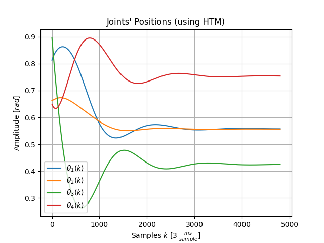
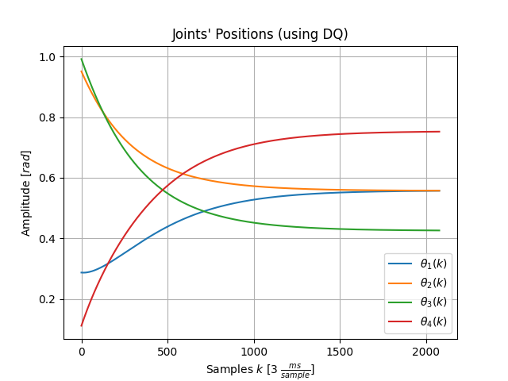

# zRobotics 0.1

A powerful library for robotics analysis :robot:

- [zRobotics 0.1](#zrobotics-01)
    - [Introduction](#introduction)
    - [Features](#features)
    - [Library Content](#library-content)
      - [Python](#python)
      - [MATLAB](#matlab)

### Introduction

**uRobot** is a simple 4 DoF antropomorphic robot that can be used to analyze and develop kinematics and control algorithms as shown in our course [Robotics: from Kinematics to Control](https://www.udemy.com/course/robotica-de-la-cinematica-al-control/?referralCode=5FF404FC9C3C95DE6D11). We hope this library will help you to start your journey in these amazing technologies!


### Features

You can control how the robot behaves; also, you'll be able to see its end - effector displacement in a 3D animation. To achieve this, all the algorithms were developed to be simulated with [Peter Corke's Robotics Toolbox](https://petercorke.com/toolboxes/robotics-toolbox/), however, **the programming logic used in these algorithms will allow you to adapt it to almost any embedded system!**


Feel free to modify, adjust and extend our work to your necessities :smiley:; these libraries allows you to get a first approach to robot analysis, synthesis and control, however, we will be adding new interesting features, also, **you can request new features or create new ones!**

### Library Content

This library includes the following algorithms:

#### [Python](/Python)

Please take a look at [main.py](/Python/main.py) to know more about this implementation :man_technologist:

- **Geometric Properties**

    ```python
        # Sets robot's generalized coordinates (two - dimensional array) and links' lengths (list)
        q = np.random.rand(4, 1)
        L = [0.3, 0.4, 0.2]
    ```

    Where  are set in radians. Also,  is the length (set in meters) of each rigid body in the kinematic chain

<Enter>

- **[Robot Creation](/Python/Robot.py)**

    ```python
        # Returns uRobot's as an object
        uRobot = Robot.System(jointsPositions = q, linksLengths = L, name = 'uRobot')
    ```

  - **Robot's properties**

    ```python
        # Returns uRobot's properties
        uRobot.jointsPositions  # two - dimensional array
        uRobot.linksLengths     # list
        uRobot.centersOfMass     # list
        uRobot.name             # string
    ```

<Enter>

---

- **Denavit - Hartenberg Parameters**

    - ***Robot's configuration***: first of all, it is mandatory to modify [Denavit - Hartenberg Parameters' file](/Python/DenavitHartenberg.py) with your robot's information, as you would do it in a sheet of paper (**do not forget to include inertial frame**). For example:

    |||||
    |:---:|:---:|:---:|:---:|
    | 0 | 0 | 0 | 0 |
    |||0||
    ||0||0|
    ||0|0||
    |||0|0|

    Therefore,

    ```python
        import numpy as np

        def matrix(robot):
            """
            Denavit - Hartenberg parameters for n - th rigid body
            theta: rotation on «z» axis
            d: translation on «z» axis
            a: translation on «x» axis
            alpha: rotation on «x» axis
            """
            return np.array([[0, 0, 0, 0],
                            [robot.jointsPositions[0, 0], robot.linksLengths[0], 0, np.pi / 2],
                            [robot.jointsPositions[1, 0], 0, robot.linksLengths[1], 0],
                            [robot.jointsPositions[2, 0], 0, 0, np.pi / 2],
                            [robot.jointsPositions[3, 0], robot.linksLengths[2], 0, 0]])
    ```

    - *Function call*
    ```python
        # Returns uRobot's Denavit - Hartenberg parameters as a matrix
        DH = dh.matrix(uRobot)
    ```
    Where  is the Denavit - Hartenberg matrix for the kinematic chain.

    <Enter>

    - ***Centers of Mass***: some calculations in robotics needs to be performed with respect to the Center of Mass, so it is mandatory to modify [Denavit - Hartenberg Parameters' file](/Python/DenavitHartenberg.py) with your robot's information, as you would do it in a sheet of paper (**do not forget to include inertial frame**). For example:

    |||||
    |:---:|:---:|:---:|:---:|
    | 0 | 0 | 0 | 0 |
    |||0||
    ||0||0|
    ||0|0||
    |||0|0|

    Therefore,

    ```python
    def centersOfMass(robot):
        """
            Denavit - Hartenberg parameters for n - th center of mass
            theta: rotation on «z» axis
            d: translation on «z» axis
            a: translation on «x» axis
            alpha: rotation on «x» axis
        """
        return np.array([[0, 0, 0, 0],
                         [robot.jointsPositions[0, 0], robot.centersOfMass[0], 0, np.pi / 2],
                         [robot.jointsPositions[1, 0], 0, robot.centersOfMass[1], 0],
                         [robot.jointsPositions[2, 0], 0, 0, np.pi / 2],
                         [robot.jointsPositions[3, 0], robot.centersOfMass[3], 0, 0]])
    ```

    - *Function call*
    ```python
        # Returns uRobot's Denavit - Hartenberg parameters of Center of Mass as a matrix
        comDH = dh.centersOfMass(uRobot)
    ```
    Where  is the Denavit - Hartenberg matrix for the kinematic chain.

<Enter>

---

- **[Forward Kinematics](/Python/Kinematics.py)**

  - Using *Homogeneous Transformation Matrices*
    ```python
        # Returns robot's forward kinematics for each individual frame (framesHTM) and for end - effector (fkHTM)
        framesHTM, fkHTM = k.forwardHTM(uRobot, m = 5)
    ```

  - Using *Dual Quaternions*
    ```python
        # Returns robot's forward kinematics for each individual frame (framesDQ) and for end - effector (fkDQ)
        framesDQ, fkDQ = k.forwardDQ(uRobot, m = 5)
    ```

Where  and  represent the robot's forward kinematics using Homogeneous Transformation Matrices and Dual Quaternions respectively. On the other hand,  and  are lists that store the pose representation for each reference frame

<Enter>

- **[Forward Kinematics to Center of Mass](/Python/Kinematics.py)**

  - Using *Homogeneous Transformation Matrices*
    ```python
        # Returns robot's forward kinematics for each individual Center of Mass (framesCOMHTM) and for end - effector's one (fkCOMHTM)
        framesCOMHTM, fkCOMHTM = k.forwardCOMHTM(uRobot, m = 5)
    ```
  - Using *Dual Quaternions*
    ```python
        # Returns robot's forward kinematics for each individual Center of Mass (framesCOMDQ) and for end - effector's one (fkCOMDQ)
        framesCOMDQ, fkCOMDQ = k.forwardCOMDQ(uRobot, m = 5)
    ```

    In this case,  and  are defined as  and  respectively

<Enter>

---

- **[Inverse Kinematics (*Error Feedback*)](/Python/Kinematics.py)**
  - Using *Homogeneous Transformation Matrices*
    ```python
        # Returns robot's inverse kinematics using HTM
        qHTM = k.inverseHTM(uRobot, q0 = np.random.rand(4, 1), Hd = fkHTM, K = np.eye(6), m = 5)
    ```
  - Using *Dual Quaternions*
    ```python
        # Returns robot's inverse kinematics using Dual Quaternions
        qDQ = k.inverseDQ(uRobot, q0 = np.random.rand(4, 1), Qd = fkDQ, K = np.eye(8), xi = xi, m = 5)
    ```
    For previous cases,  represents the number of reference frames of the system (including inertial one). Moreover,  are the initial conditions of the generalized coordinates; also,  and  represent the desired frame's pose using an Homogeneous Transformation Matrix or a Dual Quaternion respectively. Last but not least,  and  are the constant symmetric gain matrices that are used to solve inverse kinematics problem

<Enter>

**IMPORTANT NOTE:** Inverse kinematics algorithms returns a generalized coordinates vector , where  is the number of joints' positions that have to be reached

<Enter>

---

- **[Differential Kinematics](/Python/Kinematics.py)**

  - Instantaneous m - th frame velocity  using *Homogeneous Transformation Matrices*
    ```python
        # Computes Instantaneous Inertial Velocity to m - th frame, given joints' velocities «qd»
        Vhtm = k.velocityHTM(uRobot, m = 5, qd = np.random.rand(4, 1))
    ```

  - Instantaneous m - th frame velocity  using *Dual Quaternions*
    ```python
        # Computes Instantaneous Inertial Velocity to m - th frame (in dual form), given number of joints «n»,joints' velocities «qd» and Screw vectors of each joint stored in a matrix «xi»
        Vdq = k.velocityDQ(uRobot, m = 5, n = 4, qd = np.random.rand(4, 1), xi = xi)
    ```

  - Instantaneous m - th frame acceleration  using *Dual Quaternions*
    ```python
        # Computes Instantaneous Inertial Acceleration to m - th frame (in dual form), given number of joints «n», dual velocity of inertial frame «W0», joints' velocities and accelerations «qd» and «qdd»; and Screw vectors of each joint stored in a matrix «xi», including its time derivative «xid»
        Adq = k.accelerationDQ(uRobot, m = 5, n = 4, W0 = np.zeros((8, 1)), qd = qdDQ, qdd = np.random.rand(4, 1), xi = xi, xid = xid)
    ```

In this case  and  represent the m - th rigid body's velocity and acceleration in dual form, this is  and 

<Enter>

---

- **[Inverse Differential Kinematics](/Python/Kinematics.py)**

  - Instantaneous joints' velocities  using *Homogeneous Transformation Matrices*
    ```python
        # Computes Instantaneous Joints' Velocities given m - th frame one
        qdHTM = k.jointsVelocitiesHTM(uRobot, m = 5, Vhtm = Vhtm)
    ```

  - Instantaneous joints' velocities  using *Dual Quaternions*
    ```python
        # Computes Instantaneous Joints' Velocities given m - th frame one (in dual form), number of joints «n» and Screw vectors of each joint stored in a matrix «xi»
        qdDQ = k.jointsVelocitiesDQ(uRobot, m = 5, n = 4, Vdq = Vdq, xi = xi)
    ```

  - Instantaneous joints' accelerations  using *Dual Quaternions*
    ```python
        # Computes Instantaneous Joints' Accelerations given m - th frame one (in dual form), number of joints «n», joints' velocities «qd» and Screw vectors of each joint stored in a matrix «xi», including its time derivative «xid»
        qddDQ = k.jointsAccelerationsDQ(uRobot, m = 5, n = 4, W0 = np.zeros((8, 1)), qd = qdDQ, Adq = Adq, xi = xi, xid = xid)
    ```

<Enter>

---

- **[Robot Animation](/Python/Plot.py)**

    ```python
        # Plot robot with new joints' positions (this also modifies them in the object)
        plot.animation(uRobot, q = qHTM, plotBodies = True, plotFrames = True, plotCOMs = True, delayPerFrame = 1, repeatAnimation = False)
    ```
    


<Enter>

**IMPORTANT NOTE:** Nowadays, Python animation is not optimized for multibody's animation, so this will be quite slow if you want to see all the reference frames, rigid bodies and Centers of Mass. We encourage you to use the options ```plotBodies```, ```plotFrames``` and ```plotCOMs``` based on what you need to see only :wink:

<Enter>

---

- **[Plot system's function](/Python/Plot.py)**

    ```python
        # Plot any robot's behavior, such as joints' positions, dynamics, control functions, etc.
        plot.graph(function = qHTM, title = "Joints' Positions (using HTM)", labels = r'$\theta_', complement = r'(k)$', xlabel = r'Samples $k$ [3 $\frac{ms}{sample}$]', ylabel = r'Amplitude [$rad$]', save = True, name = "qHTM", transparent = True)
        plot.graph(function = qDQ, title = "Joints' Positions (using DQ)", labels = r'$\theta_', complement = r'(k)$', xlabel = r'Samples $k$ [3 $\frac{ms}{sample}$]', ylabel = r'Amplitude [$rad$]', save = True, name = "qDQ", transparent = False)
    ```




<Enter>

---

  - Under construction... :nerd_face:

<Enter>

---

#### [MATLAB](/MATLAB)

  - **[Denavit - Hartenberg Parameters](/MATLAB/denavitHartenberg.m)**

    ```matlab
        % Returns uRobot's Denavit - Hartenberg parameters as a matrix
        DH = denavitHartenberg(q, L);
    ```
    Where  are the generalized coordinates (set in radians) of the system. Also,  is the length (set in meters) of each rigid body in the kinematic chain

<Enter>

---

  - **Forward Kinematics**

    - [using *Homogeneous Transformation Matrices*](/MATLAB/forwardKinematicsDH.m)
    ```matlab
        % Returns robot's forward kinematics based on «DH» matrix
        H = forwardKinematicsDH(DH, m);
    ```
    - [using *Dual Quaternions*](/MATLAB/forwardKinematicsDQ.m)
    ```matlab
        % Returns robot's forward kinematics based on «DH» matrix
        DQ = forwardKinematicsDQ(DH, m);
    ```
<Enter>

---

  - **Inverse Kinematics (*Error Feedback*)**
    - [using *Homogeneous Transformation Matrices*](/MATLAB/inverseKinematics.m)
    ```matlab
        % Returns robot's inverse kinematics using HTM
        qi = inverseKinematics(q0, L, Hd, K, m);
    ```
    - [using *Dual Quaternions*](/MATLAB/inverseKinematicsDQ.m)
    ```matlab
        % Returns robot's inverse kinematics using Dual Quaternions
        qi = inverseKinematicsDQ(q0, L, Qd, KQ, m);
    ```
    For previous cases,  represents the number of reference frames of the system (including inertial one). Moreover,  are the initial conditions of the generalized coordinates; also,  and  represent the desired frame's pose using an Homogeneous Transformation Matrix or a Dual Quaternion respectively. Last but not least,  and  are the constant symmetric gain matrices that are used to solve inverse kinematics problem

<Enter>

---

  - **Differential Kinematics**
    - [End - effector Velocity](/MATLAB/endEffectorVelocityDQ.m)
    ```matlab
        % Returns instantaneous end - effector (angular and linear) velocity  in dual form
        W = endEffectorVelocityDQ(q, qd, DH, m);
    ```

    - [End - effector Acceleration](/MATLAB/endEffectorAccelerationDQ.m)
    ```matlab
        % Returns instantaneous end - effector (angular and linear) acceleration in dual form
        Wd = endEffectorAccelerationDQ(q, qd, qdd, DH, m);
    ```

    - [Joints' Velocities](/MATLAB/jointsVelocitiesDQ.m)
    ```matlab
        % Returns instantaneous joints' velocities «qd»
        qd = jointsVelocitiesDQ(q, W, DH, m);
    ```

    - [Joints' Accelerations](/MATLAB/jointsAccelerationsDQ.m)
    ```matlab
        % Returns instantaneous joints' accelerations «qdd»
        qdd = jointsAccelerationsDQ(q, qd, Wd, DH, m);
    ```
    Being  (``` qd, qdd ```) the instantaneous velocity and acceleration of generalized coordinates . Also,  (``` W, Wd ```) are the instantaneous end - effector velocity and acceleration in dual form. **For the case of the joint's acceleration computation, do not forget to include the gravitational acceleration (in dual form) in order to get a more accurate result**

<Enter>

---

  - **Dynamic System Solver and Simulation**
    - [Numerical Solver](/MATLAB/solver.m)
    ```matlab
        % Returns ODE solution using fourth order Runge - Kuta algorithm
        F = solver(f, F, h);
    ```

    - [Simulator](/MATLAB/dynamicSystem.m)
    ```matlab
        % Returns Dynamic System's simulation results
        [e, q, u, V] = dynamicSystem(q0, qd, K, t);
    ```

    Where  represent the differential equation and its **previous solution** respectively; on the other hand,  0"> is the step that solver needs to compute ODE solution, so the return argument  will be the **current solution**
    
    Furthermore,  is a positive definite constant matrix used by the control function , where  represents the error between the desired joints position  and the current one . This control function leads the joints to the desire position, meanwhile  deals with the uncertainty that can be generated by disturbances, measurement noise, etc.
    
    **If you want to know more about these control functions and how you can implement them in your projects, check out our course [Control of Dynamic Systems](https://www.udemy.com/course/control-de-sistemas-dinamicos/?referralCode=74300CF3F21F98714329)** :wink:

<Enter>

---

- **Robot Creation and Animation (using [Peter Corke's Robotics Toolbox](https://petercorke.com/toolboxes/robotics-toolbox/))**
    
    - Create robot's joints positions
    
    ```matlab
        % Returns uRobot's generalized coordinates vector
        q = [q1
             q2
             q3
             q4];
    ```

    - Create robot's links or rigid bodies length
    
    ```matlab
        % Returns uRobot's rigid bodies length
        L = [l1 l2 l3];
    ```

    - Create robot's links as **objects**
    
    ```matlab
        % Returns uRobot's rigid bodies as objects
        L1 = Link('d', L(1), 'a', 0, 'alpha', pi/2);
        L2 = Link('d', 0, 'a', L(2), 'alpha', 0);
        L3 = Link('d', 0, 'a', 0, 'alpha', pi/2);
        L4 = Link('d', L(3), 'a', 0, 'alpha', 0);
    ```

    - Create kinematic chain as an **object**
    
    ```matlab
        % Returns uRobot
        uRobot = SerialLink([L1, L2, L3, L4], 'name', 'uRobot');
    ```

    - Plot **uRobot**
    
    ```matlab
        % Returns uRobot plot
        uRobot.plot(q')
    ```

    **IMPORTANT NOTE:** Inverse kinematics algorithms returns a generalized coordinates vector , where  is the number of joints' positions that have to be reached. In order to use ```uRobot.plot( )```, we have to transpose , otherwise, we won't be able to see the robot's animation

---

**We hope this can be useful for you. Thank you!**

<Enter>
    

